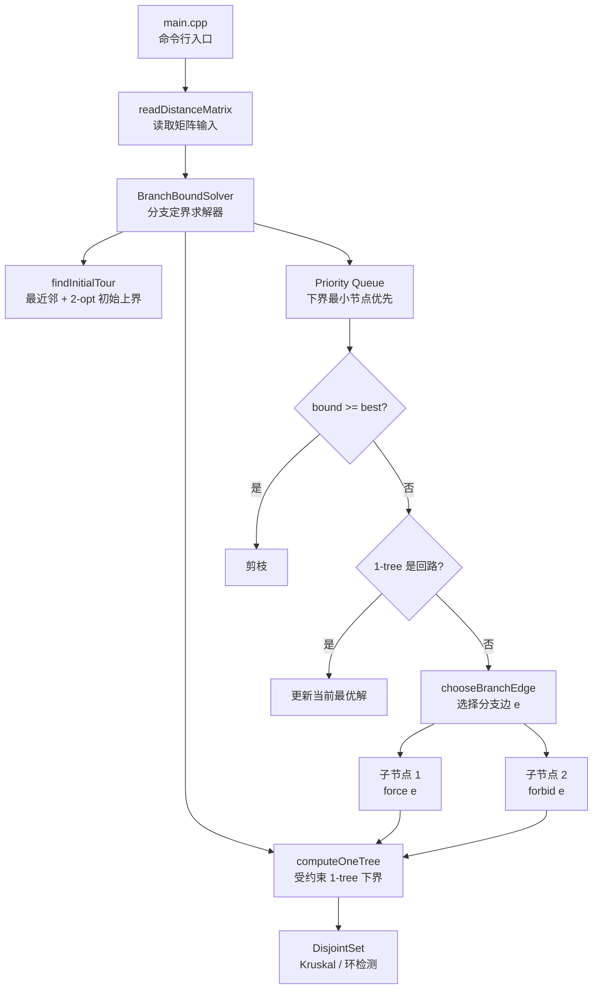

# TSP 分支定界求解器

本项目使用 C++ 实现经典旅行商问题（TSP）的基本分支定界算法。当前版本面向**对称 TSP**，输入是完整距离矩阵或带缺边的对称距离矩阵。

核心设计：

- 使用分支定界搜索。
- 以无向边作为分支变量。
- 每个搜索节点维护两类边约束：`forced` 表示必须选，`forbidden` 表示禁止选。
- 下界使用受约束 `1-tree`：在顶点 `1..n-1` 上构造 MST，再给顶点 `0` 加两条可用的最短关联边。
- 初始上界使用最近邻启发式加 `2-opt` 改进。
- 支持单实例求解、批处理求解、随机实例生成、独立精确校验和 TSPLIB 转换。

## 总体架构



`main.cpp` 只负责命令行解析、输入读取和结果输出。核心算法集中在 `BranchBoundSolver` 中，包括 1-tree 下界、分支边选择、剪枝和最优解更新。

## 构建

```bash
cmake -S . -B build
cmake --build build
```

生成的可执行文件为：

```bash
./build/tsp_bb
```

## 输入格式

程序读取一个方阵。第一项是顶点数 `n`，后面是 `n * n` 个距离。

```text
5
0  2  9 10  7
2  0  6  4  3
9  6  0  8  5
10 4  8  0  6
7  3  5  6  0
```

缺边可以写成 `inf`、`infinity`、`-` 或 `x`。顶点编号在输出中使用从 `0` 开始的索引。

## 单实例运行

从文件读取：

```bash
./build/tsp_bb examples/five-city.txt
```

从标准输入读取：

```bash
./build/tsp_bb < examples/five-city.txt
```

典型输出包含根节点下界、初始上界、搜索节点数、剪枝数、最优值和最优回路。

## 批处理运行

批处理模式读取一个清单文件，每行一个实例路径。空行和以 `#` 开头的行会被忽略。

```bash
./build/tsp_bb --batch examples/batch.txt
```

输出是 CSV，字段为：

```text
instance,status,cost,root_lower_bound,initial_upper_bound,nodes_created,nodes_expanded,pruned_by_bound,pruned_infeasible,tour,message
```

后续验证经典数据集时，可以把转换后的实例路径写入一个清单文件：

```bash
./build/tsp_bb --batch path/to/classic-list.txt > classic-results.csv
```

## TSPLIB 转换

`tools/tsplib_to_matrix.py` 可以把常见 TSPLIB 对称 TSP 实例转换成本项目的矩阵格式。

支持的 `EDGE_WEIGHT_TYPE`：

- `EUC_2D`
- `CEIL_2D`
- `FLOOR_2D`
- `MAN_2D`
- `MAX_2D`
- `EUC_3D`
- `CEIL_3D`
- `MAN_3D`
- `MAX_3D`
- `ATT`
- `GEO`
- `EXPLICIT`

支持的 `EDGE_WEIGHT_FORMAT`：

- `FULL_MATRIX`
- `UPPER_ROW`
- `UPPER_DIAG_ROW`
- `LOWER_ROW`
- `LOWER_DIAG_ROW`
- `UPPER_COL`
- `UPPER_DIAG_COL`
- `LOWER_COL`
- `LOWER_DIAG_COL`

当前 C++ 求解器只支持对称 TSP，所以转换器默认会检查输出矩阵是否对称。`TYPE=ATSP` 这类非对称实例不会被转换给当前求解器。

转换单个 TSPLIB 文件：

```bash
python3 tools/tsplib_to_matrix.py \
  examples/tsplib/five-node-euc.tsp \
  --output examples/converted/five-node-euc.txt
```

转换多个 TSPLIB 文件，并生成批处理清单：

```bash
python3 tools/tsplib_to_matrix.py \
  path/to/tsplib/*.tsp \
  --output-dir examples/classic \
  --batch-list examples/classic/batch.txt
```

然后批量求解：

```bash
./build/tsp_bb --batch examples/classic/batch.txt > classic-results.csv
```

如果只想快速查看转换结果，也可以不指定 `--output`，转换器会把矩阵写到标准输出：

```bash
python3 tools/tsplib_to_matrix.py examples/tsplib/five-node-euc.tsp
```

## 随机实例生成

生成完整随机对称图：

```bash
python3 tools/generate_random_instances.py \
  --output examples/random/complete \
  --count 10 \
  --min-n 4 \
  --max-n 8 \
  --seed 20260508 \
  --prefix rnd
```

生成稀疏随机图。脚本会先嵌入一条 Hamilton 回路，保证实例至少有一个可行解：

```bash
python3 tools/generate_random_instances.py \
  --output examples/random/sparse \
  --count 6 \
  --min-n 5 \
  --max-n 8 \
  --seed 20260509 \
  --prefix rnd \
  --sparse-density 0.35
```

生成目录中会自动包含 `batch.txt`，可直接用于批处理。

## 独立校验

`tools/verify_instances.py` 使用 Held-Karp 动态规划独立计算精确最优值，再和 `tsp_bb` 的输出比较。

```bash
python3 tools/verify_instances.py \
  --batch-list examples/batch.txt \
  --solver ./build/tsp_bb
```

Held-Karp 是指数级算法，只适合小规模实例验证。默认只校验 `n <= 12` 的实例。

## 当前示例

项目内包含：

- `examples/five-city.txt`：手写 5 点矩阵实例。
- `examples/random/complete/`：完整图随机实例。
- `examples/random/sparse/`：含缺边但保证可行的随机实例。
- `examples/tsplib/`：TSPLIB 风格转换测试实例。
- `examples/batch.txt`：统一批处理清单。

## 可以训练到的 C++ 能力

这个项目不只是一个 TSP 算法脚本，也可以作为小型 C++ 算法工程训练项目。

涉及的 C++ 技术：

- `std::vector`：存储矩阵、边集合、路径、度数和搜索状态。
- `struct` / `class`：封装 `BranchBoundSolver`、`Edge`、`Node`、`OneTree` 和求解结果。
- RAII 风格文件输入：使用 `std::ifstream` 和 `std::istream`。
- 异常处理：使用 `std::runtime_error` 报告非法输入和不支持的矩阵。
- STL 算法：`std::sort`、`std::reverse`、`std::all_of`、`std::iota`、`std::move`。
- `std::priority_queue`：实现下界最小优先的 best-first 搜索。
- 自定义比较器：控制优先队列排序规则。
- 并查集：用于 Kruskal MST 和环检测。
- 浮点处理：无穷大、有限性检查和误差容忍。
- CMake：组织构建、设置头文件路径、设置 C++ 标准和警告选项。

涉及的算法与工程能力：

- TSP 和 Hamilton 回路建模。
- 1-tree 下界构造。
- 分支定界剪枝。
- 边约束状态建模。
- 最近邻和 2-opt 启发式上界。
- 随机测试、批处理实验和独立正确性验证。
- TSPLIB 数据转换和经典数据集实验准备。
