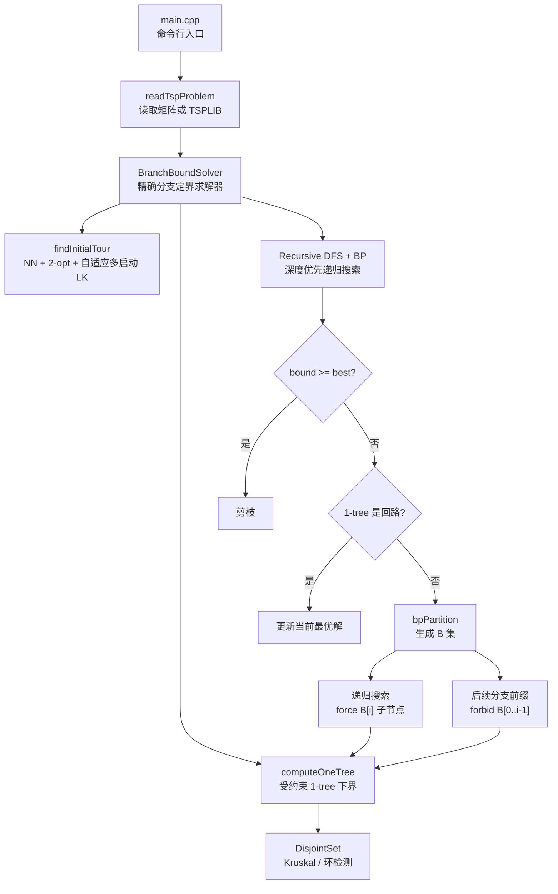

# TSP 分支定界求解器

本项目使用 C++ 实现旅行商问题（TSP）的分支定界算法。当前版本面向**对称 TSP**，输入可以是完整距离矩阵、带缺边的对称距离矩阵或受支持的 TSPLIB 文件。

默认 CMake 目标和可执行文件均命名为 `tsp_bb`：按度数违规顶点选择分支边，并使用当前增量 MST / 1-tree 优化。MST 分支归档产物位于 `solver/07-20-MST/tsp_bb`，修改说明见 `solver/07-20-MST/07-20-MST.md`。四个 `07_14` 实验变体仍由同一份 `src/TspSolver.cpp` 编译，用于历史策略对比。

核心设计：

- 使用分支定界搜索。
- 以无向边作为分支变量。
- 精确求解使用递归 DFS 和 BP（branch partitioning）多路分支，不使用优先队列。
- 每个搜索节点维护 `forced` 必选边、`forbidden` 排除边及经过约束过滤的候选边。
- 默认 `deg` 策略从当前 1-tree 的度数违规顶点选择未决边；`min_edge` 策略从整个 1-tree 选择最轻未决边。
- 下界使用受约束 `1-tree`：在顶点 `1..n-1` 上构造 MST，再给顶点 `0` 加两条可用的最短关联边。
- 根节点默认用 Polyak 次梯度优化 Held-Karp 顶点势，随后在整轮 DFS 中固定
  势和边权；也可切换到 Helsgaun、两种先后组合或 Polyak 方向平滑实验策略。
- 根 1-tree 建立后使用 Held–Karp reduced cost 检查所有边：若强制一条
  非树边的下界已不能改善 incumbent，就永久停用该边；若禁止一条树边的
  replacement 下界已不能改善 incumbent，就将其强制为 `x_e=1` 并重建根树。
- 初始上界使用多起点最近邻、`2-opt` 和 LK；不同的 NN+2-opt 局部最优
  会进入候选池，搜索节点超过自适应预算后追加多启动 LK。若上界改善，
  当前 DFS 会完整回退，并用新上界重新优化根势后重启。
- 支持单实例、批处理、随机实例生成、独立精确校验和 TSPLIB 直接读取。

## 总体架构


```mermaid
flowchart TD
    A["main.cpp<br/>命令行入口"] --> B["readTspProblem<br/>读取矩阵或 TSPLIB"]
    B --> D["BranchBoundSolver<br/>精确分支定界求解器"]
    D --> R["findInitialTour<br/>NN + 2-opt + 自适应多启动 LK"]
    D --> E["computeOneTree<br/>受约束 1-tree 下界"]
    E --> F["DisjointSet<br/>Kruskal / 环检测"]
    D --> G["Recursive DFS + BP<br/>深度优先递归搜索"]
    G --> H{"bound >= best?"}
    H -- "是" --> I["剪枝"]
    H -- "否" --> J{"1-tree 是回路?"}
    J -- "是" --> K["更新当前最优解"]
    J -- "否" --> L["bpPartition<br/>生成 B 集"]
    L --> M["递归搜索<br/>force B[i] 子节点"]
    L --> N["后续分支前缀<br/>forbid B[0..i-1]"]
    M --> E
    N --> E
```

`main.cpp` 负责命令行解析、输入读取和结果输出。精确算法集中在 `BranchBoundSolver` 中，包括递归分支定界、1-tree 下界、分支边选择、剪枝和最优解更新。

完整的仓库组件图、构建关系、`solve/search/bpPartition` 流程图、Prim 势更新流程和对应伪代码见 [`docs/PHKMST-project-architecture-and-algorithms.md`](docs/PHKMST-project-architecture-and-algorithms.md)。

## 构建

```bash
cmake -S . -B build -DCMAKE_BUILD_TYPE=Release
cmake --build build --target tsp_bb
```

主可执行文件为 `./build/tsp_bb`，使用 degree 分支策略和当前增量 MST / 1-tree 实现。MST 分支的已编译归档副本命名为 `solver/07-20-MST/tsp_bb`。

四个可复现实验目标如下：

| CMake 目标 / 可执行文件 | 分支策略 | 子节点 1-tree | 编译宏 |
|---|---|---|---|
| `tsp_bb_26_07_14_deg` | degree | 增量 | 无（默认配置） |
| `tsp_bb_26_07_14_min_edge` | min-edge | 增量 | `TSP_BRANCH_STRATEGY_MIN_EDGE` |
| `tsp_bb_26_07_14_full_deg` | degree | 全量重建 | `TSP_DISABLE_INCREMENTAL_ONETREE` |
| `tsp_bb_26_07_14_full_min_edge` | min-edge | 全量重建 | 两个宏同时定义 |

按名称构建单个变体，或一次构建全部变体：

```bash
cmake --build build --target tsp_bb_26_07_14_full_deg
cmake --build build --target tsp_bb_variants
```

四个命名目标默认不参与普通的 `cmake --build build`，避免每次重复编译。`solver/tsp_bb_26_07_14_*` 中的文件是归档产物；验证当前源码时应使用上述 CMake 目标重新构建。

本轮 `07_14` 正确性修复的可复现源码提交是 `313143543b29a3ed469e5296f5356b4ddc12109d`。四个归档目录的 readme 分别记录了完整 hash、目标名和跨系统构建命令；目录内旧二进制不代表该提交，应以重新构建的目标为准。

## 输入格式

程序读取一个方阵。第一项是顶点数 `n`，后面是 `n * n` 个距离。

```text
5
0  2  9 10  7
2  0  6  4  3
9  6  0  8  5
10 4  8  0  6
7  3  5  6  0
```

缺边可以写成 `inf`、`infinity`、`-` 或 `x`。顶点编号在输出中使用从 `0` 开始的索引。

程序也可以直接读取常见 TSPLIB `TSP` 文件，包括 `NODE_COORD_SECTION`
坐标型实例和 `EDGE_WEIGHT_SECTION` 显式矩阵实例。当前 C++ 读取器支持
`EUC_2D`、`CEIL_2D`、`FLOOR_2D`、`MAN_2D`、`MAX_2D`、`EUC_3D`、
`CEIL_3D`、`MAN_3D`、`MAX_3D`、`ATT`、`GEO` 和常见显式矩阵格式。

## 单实例运行

从文件读取：

```bash
./build/tsp_bb examples/five-city.txt
```

程序始终运行精确分支定界。`--exact-max-n` 是构造稠密距离矩阵前的规模保护参数，默认值为 `10000`；它不是复杂度保证。需要降低保护上限时可以显式指定：

```bash
./build/tsp_bb --exact-max-n 5 examples/five-city.txt
```

分支定界具有指数级最坏复杂度，实际使用仍应优先从小实例开始。

可以提供外部启发式回路作为初始上界（单实例）：

```bash
./build/tsp_bb --initial-tour examples/five-city.initial-tour.txt examples/five-city.txt
```

回路文件为 `n` 后接 `n` 个从 0 开始、不重复起点的顶点编号；不是 TSPLIB
`TOUR_SECTION` 格式。求解器验证排列及所有边、重新计算成本，并与内置启发式
择优，不会把外部回路当作最优证明或限制精确搜索边集。可选的 Concorde Linkern
研究接口和候选集/定价实验见 [实验工具说明](tools/experiments/README.md)，
完整结果见 [CPHKMST 探索报告](docs/CPHKMST-candidate-pricing-exploration-2026-09-11.md)。

查看主求解过程中的实时 debug 输出：

```bash
./build/tsp_bb --debug --debug-interval 1000 examples/five-city.txt
```

debug 信息写到标准错误，不会破坏批处理模式的 CSV 标准输出。求解器会输出初始上界、
根节点下界、周期性搜索节点统计和新 incumbent。

`--debug-interval` 必须是大于 `0` 的整数。未指定 `--debug` 时不会输出 debug 信息。

### Held-Karp 根上升策略

默认策略保持当前 HKMST 的 Polyak 步长。以下选项可用于论文策略对照：

```bash
./build/tsp_bb --hk-ascent polyak data/classic/tsplib/eil101.tsp
./build/tsp_bb --hk-ascent helsgaun data/classic/tsplib/eil101.tsp
./build/tsp_bb --hk-ascent hybrid data/classic/tsplib/eil101.tsp
./build/tsp_bb --hk-ascent hybrid-reverse data/classic/tsplib/eil101.tsp
./build/tsp_bb --hk-ascent polyak-smoothed data/classic/tsplib/eil101.tsp
./build/tsp_bb --hk-ascent polyak-smoothed-dynamic data/classic/tsplib/eil101.tsp
./build/tsp_bb --hk-ascent none data/classic/tsplib/eil101.tsp
```

- `none`：原始固定根 1-tree，不使用顶点势；
- `polyak`：当前默认，使用 incumbent gap 归一化步长；
- `helsgaun`：使用论文的 period/步长减半和 `0.7/0.3` 平滑次梯度；
- `hybrid`：先执行 Polyak，再从其最佳势出发用 Helsgaun 调度精修，并保留
  固定根下界更强的势。
- `hybrid-reverse`：先执行 Helsgaun，再从其最佳势出发用 Polyak 精修，同样
  保留两阶段中更强的势；
- `polyak-smoothed`：保持 Polyak 步长、停滞折半和停止条件，仅把更新方向改为
  `0.7 * 当前次梯度 + 0.3 * 上一次梯度`；
- `polyak-smoothed-dynamic`：保持 Polyak 其余行为，按相邻次梯度的余弦相似度将
  当前方向权重动态限制在 `0.5--0.9`；正交时为 `0.7/0.3`。

两个平滑策略的当前次梯度权重可通过以下参数控制：

```bash
./build/tsp_bb --hk-ascent polyak-smoothed-dynamic \
  --root-ascent-smoothing-current-weight 0.65 \
  --root-ascent-dynamic-cosine-scale 0.15 \
  --root-ascent-dynamic-min-current-weight 0.4 \
  --root-ascent-dynamic-max-current-weight 0.85 \
  data/classic/tsplib/eil101.tsp
```

`--root-ascent-smoothing-current-weight` 是固定策略的当前方向权重，也是动态策略
在余弦相似度为 `0` 时的基准；动态策略先计算“基准 + 余弦缩放 × 相似度”，
再限制到配置的最小值和最大值。三个权重必须满足
`0 <= 最小值 <= 基准值 <= 最大值 <= 1`，余弦缩放必须非负；未指定时采用
基准 `0.7`、缩放 `0.2`、范围 `0.5--0.9`，与原实验实现一致。

只比较根下界而不进入精确搜索：

```bash
./build/tsp_bb --root-bound-only --hk-ascent polyak \
  --batch data/classic/batch-hk-ascent.txt
```

此模式输出的 `method` 为 `root-bound`；`cost/tour` 是启发式可行上界，不是
最优证明。完整实验与结论见
[`docs/HKMST-LKH-1tree-experiment-2026-08-06.md`](docs/HKMST-LKH-1tree-experiment-2026-08-06.md)。

#### 根势逐轮趋势图

`tools/plot_root_ascent.py` 对每个选中的实例分别运行上述六种根势实现，
并把六种逐轮下界轨迹画在同一张二维图
中：浅色细线显示每次 1-tree 评估的原始下界，粗实线显示历史最佳下界。
横轴是根势评估轮次，纵轴是根 1-tree 下界；Concorde 的精确最优值作为水平
参考线。六次 `tsp_bb` 调用都强制使用 `--root-bound-only`，脚本还会检查
`Nodes expanded` 必须为 0，因此不会进入分支定界递归。

直接选择一个或多个实例：

```bash
python3 tools/plot_root_ascent.py \
  data/classic/tsplib/eil51.tsp \
  data/classic/tsplib/berlin52.tsp
```

也可用清单配置实例（空行和以 `#` 开头的行会忽略）：

```bash
python3 tools/plot_root_ascent.py \
  --batch-list data/classic/batch-hk-ascent.txt
```

若已有消融实验的 Concorde `results.csv`，可直接复用其中所有成功实例及其
精确最优值，不会再次启动 Concorde；目录和 CSV 文件路径都可接受。可用
`--workers` 并发处理不同实例：

```bash
python3 tools/plot_root_ascent.py \
  --concorde-results outputs/phkmst-ablation_902/Concorde-7c32cb4cd69e \
  --workers 8
```

默认每个上升阶段最多评估 2000 轮，可随时调整；求解器原有的收敛停止条件仍
然生效，所以实际轮数可能少于上限。两种 Hybrid 的 Polyak 和 Helsgaun 阶段
分别使用该上限，图上横轴按实际先后顺序连接两个阶段。默认每 400 轮展开为
一段 1600 像素宽的横轴，因此 0--2000 轮会连续
展开为五段；总览页每行显示一个实例，并允许横向滚动查看完整长图。可用
`--chart-width` 调整每段宽度，用 `--iterations-per-width` 调整每段覆盖的
轮数，二者都不会改变势优化过程：

```bash
python3 tools/plot_root_ascent.py \
  --iterations 4000 \
  --root-ascent-smoothing-current-weight 0.65 \
  --root-ascent-dynamic-cosine-scale 0.15 \
  --root-ascent-dynamic-min-current-weight 0.4 \
  --root-ascent-dynamic-max-current-weight 0.85 \
  --chart-width 1800 \
  --iterations-per-width 400 \
  --solver build/tsp_bb \
  --concorde /path/to/native/concorde \
  --output-root outputs/root-ascent-trends \
  data/classic/tsplib/eil101.tsp
```

每个实例有独立目录，包含：

- `root-ascent-trends.svg`：六策略曲线与 Concorde 参考线，无需 matplotlib；
- `root-ascent-trends.csv`：合并后的逐轮原始下界、历史最佳下界及最优值；
- `<strategy>.csv`：六种策略各自由求解器直接记录的原始轨迹；
- `metadata.json`：轮数及方向权重配置、实际评估数、命令和可执行文件路径。

多实例运行还会在输出根目录生成 `index.html` 图表总览和 `summary.csv` 实例级
汇总；汇总中包含各策略的最终根下界、相对 Concorde gap 和实际评估轮数。
总览中每个实例的表格下方提供六种根势策略和 Concorde 开关，
可独立显示或隐藏对应曲线；关闭某个策略时，其原始下界细线和历史最优粗线会
一起隐藏。

也可以绕过绘图器，直接记录单次根势轨迹：

```bash
./build/tsp_bb --root-bound-only --hk-ascent polyak \
  --root-ascent-iterations 2000 \
  --root-ascent-trace /tmp/eil51-polyak.csv \
  data/classic/tsplib/eil51.tsp
```

### 根 α-nearness 分支顺序

局部策略保持原 BP 规则：先固定一个最大度违规顶点，再用根静态 α 排序其
关联边。全局策略则考察当前 1-tree 中所有至少接触一个度违规顶点的未决边，
先比较 α，平局时再优先两端超度覆盖量较大的边：

```bash
./build/tsp_bb --branch-edge-order root-alpha-asc input.tsp
./build/tsp_bb --branch-edge-order root-alpha-desc input.tsp
./build/tsp_bb --branch-edge-order root-alpha-global-asc input.tsp
./build/tsp_bb --branch-edge-order root-alpha-global-desc input.tsp
```

这些选项只改变 BP 分支边顺序，不改变候选集、1-tree 下界或精确性。

参数消融运行器内置 Concorde 和多种 PHKMST 配置，默认按代码中的顺序全部
执行。也可用 `--configs` 选择需要的子集；当前配置先跑完全部实例、写出独立
结果与汇总，之后才开始下一配置。

```bash
python3 tools/run_phkmst_ablation.py \
  --configs Concorde P0 P1 H0 \
  --workers 5 \
  --output-root outputs/phkmst-ablation
```

默认实例清单是 `data/classic/batch-ablation-smoke.txt`，也可用 `--batch-list`
或 `--instances` 替换。调用方式与 `tools/compare_strategies.py` 一致：每个实例
单独启动求解进程，Concorde 使用固定 seed 和独立临时目录，`--timeout` 按实例
生效，同一配置内部再由 `--workers` 并行。可用 `--list-configs` 查看代码配置区
的完整求解器路径与参数；新增配置直接编辑下述代码配置区。

求解器版本及参数统一在脚本顶部“用户配置区 2”中声明。每个 `Strategy` 都直接
保存自己的 `executable` 和 `solver_args`，因此同一次实验可以混用多个二进制，
且不同版本完全不需要使用相同参数。例如可在 `SOLVER_CONFIGURATIONS` 中加入：

```python
Strategy(
    name="legacy",
    kind="tsp_bb",
    category="version",
    executable=PROJECT_ROOT / "build" / "tsp_bb_26_07_02",
    solver_args=solver_arguments("--branch-strategy smart"),
    description="2026-07-02 archived solver"),
Strategy(
    name="current",
    kind="tsp_bb",
    category="version",
    executable=PROJECT_ROOT / "build" / "tsp_bb",
    solver_args=solver_arguments(
        "--hk-ascent polyak --hk-potential-update none"),
    description="current solver"),
```

之后直接用 `--configs legacy current` 选择即可。运行器会分别从两个程序的
`--help` 探测参数能力：`--exact-max-n`、debug 等运行器参数只会传给支持它们的
版本；会改变实验含义的策略参数如果不受支持，对应配置会被明确跳过，不会静默
降级。求解器路径和参数不再从命令行拼接，运行命令只负责用 `--configs` 选择
代码中已经定义完整的配置。

CSV 统计列集中定义在“用户配置区 1”的 `OUTPUT_STATISTICS`。当前默认输出成本、
创建节点数（兼容列名 `branches`）、扩展节点数、下界剪枝数、不可行剪枝数、
根 reduced-cost fixing 的调用次数、测试/固定边数、剩余 active 边数与耗时，
根节点势优化总轮次、搜索节点势更新候选数、触发次数、十类互斥的未触发原因，
以及搜索节点势优化总轮次，并在 `summary.csv` 中生成对应的 total/median。
继续扩充时只需增加标签、类型和是否汇总；求解器后来新增但未登记的
`标签: 值` 会被安全忽略，不影响解析。

每种配置会生成独立的指纹目录。`results.csv` 保存运行时间、求解结果、创建与
扩展节点数、两项剪枝数和上述三项势优化统计，以及关联所需的配置、重复次数、
实例和状态字段。tsp_bb 的兼容列 `branches` 取 `nodes_created`，Concorde 取
`bbnodes`。`summary.csv` 是该配置自己的耗时、节点数、剪枝数和势优化统计汇总，
`configuration.csv` 记录二进制摘要及完整命令。跨配置对比不在本脚本中完成，
后续可由单独的汇总程序读取这些表。

Concorde 使用独立的精简表头：逐实例结果只保留固定标识字段、`wall_seconds`、
`result` 和 `branches`；汇总表只统计 wall time 与 branches。PHKMST 专属的
根势、搜索节点、剪枝和未触发原因不会在 Concorde CSV 中生成空列。

每完成一个“策略/重复/实例”调用，脚本就立即原子更新该策略的结果表、汇总、
进度以及共享 `cache.json`，不会等待同一策略的其他实例。成功和超时结果在再次
执行相同命令时直接复用；普通错误也保留在缓存中供检查，但下次仍会重试。
二进制、策略参数、实例或运行设置变化后会使用新的指纹，不会混入旧表。需要
清空当前实验缓存时使用 `--fresh`。

若只想快速完成当前策略的一部分，可限制本次新调用数：

```bash
python3 tools/run_phkmst_ablation.py \
  --configs P0 H0 \
  --batch-list data/classic/batch-hk-ascent.txt \
  --max-runs 4 \
  --output-root outputs/phkmst-ablation
```

如果四次调用不足以完成 `P0`，流水线会在写出 `P0` 的部分表后停止，不会提前
运行 `H0`；重新执行同一命令即可从缓存继续。可先加 `--print-commands` 检查
每个策略的实际命令和输出目录而不启动实验。

### 搜索节点势更新实验

根节点仍先执行 `--hk-ascent`。后续节点可从当前势 warm start，在当前
forced/forbidden/active-candidate 约束下运行有限轮势上升。节点内部默认使用
Polyak；`--hk-node-ascent` 还支持 `helsgaun`、`polyak-smoothed` 和
`polyak-smoothed-dynamic`。后两者保留节点 Polyak 的步长、probe、停滞折半和
停止条件，只分别换成固定与余弦动态平滑方向。触发机制及 epoch 生命周期保持
不变。启用搜索节点势更新时，永远重建所有依赖势的排序和增量状态，使新势在
整个锚点子树中持续生效，回溯到兄弟节点时恢复。节点上升另以 0.25 权重
阻尼复用最近兄弟节点的最终势；默认 `guarded` 模式先在当前约束图上评估
混合势，仅当其下界严格强于父势已有证书时采用。

```bash
# 推荐配置：距上次更新至少 2 层，且节点 gap 不超过 2%
./build/tsp_bb --hk-node-ascent polyak \
  --hk-potential-update subtree-adaptive \
  --hk-update-depth 2 --hk-update-gap-ratio 0.02 \
  --hk-update-iterations 16 --hk-update-budget 5000 input.tsp

# 关闭跨兄弟节点的势 warm start，复现原始父 epoch 起点
./build/tsp_bb --hk-sibling-warm-start off \
  --hk-potential-update subtree-adaptive input.tsp

# 复现此前不做准入验证、直接使用混合势的行为
./build/tsp_bb --hk-sibling-warm-start blend \
  --hk-sibling-warm-weight 0.25 \
  --hk-potential-update subtree-adaptive input.tsp

# 初始 CLK：先跑一个起点，根相对 gap 至少 2% 时再追加最多两个起点
./build/tsp_bb --initial-clk adaptive \
  --adaptive-clk-gap-ratio 0.02 \
  --adaptive-clk-additional-starts 2 input.tsp

# 同一触发配置下对照节点 Helsgaun 调度
./build/tsp_bb --hk-node-ascent helsgaun \
  --hk-potential-update subtree-adaptive \
  --hk-update-depth 2 --hk-update-gap-ratio 0.02 \
  --hk-update-iterations 16 --hk-update-budget 5000 input.tsp

# 固定方向融合：0.65 当前次梯度 + 0.35 上一次次梯度
./build/tsp_bb --hk-node-ascent polyak-smoothed \
  --hk-node-smoothing-current-weight 0.65 \
  --hk-potential-update subtree-adaptive \
  --hk-update-depth 2 --hk-update-gap-ratio 0.02 \
  --hk-update-iterations 16 --hk-update-budget 5000 input.tsp

# 动态方向融合：clamp(0.65 + 0.15*cosine, 0.4, 0.85)
./build/tsp_bb --hk-node-ascent polyak-smoothed-dynamic \
  --hk-node-smoothing-current-weight 0.65 \
  --hk-node-dynamic-cosine-scale 0.15 \
  --hk-node-dynamic-min-current-weight 0.4 \
  --hk-node-dynamic-max-current-weight 0.85 \
  --hk-potential-update subtree-adaptive \
  --hk-update-depth 2 --hk-update-gap-ratio 0.02 \
  --hk-update-iterations 16 --hk-update-budget 5000 input.tsp

# 实验性两阶段门：gap<=2% 直接跑满；2%<gap<=5% 先移动势一次，
# 若已覆盖原 UB-LB gap 的至少 5%，再继续到 16 轮
./build/tsp_bb --hk-node-ascent polyak \
  --hk-potential-update subtree-adaptive \
  --hk-update-depth 2 --hk-update-gap-ratio 0.05 \
  --hk-update-iterations 16 --hk-update-budget 5000 \
  --hk-update-probe-updates 1 \
  --hk-update-probe-min-gap-ratio 0.02 \
  --hk-update-probe-min-coverage 0.05 input.tsp

# gap 分档：所有 gap 至少 16 轮，gap>=2% 时最多 32 轮
./build/tsp_bb --hk-node-ascent polyak \
  --hk-potential-update subtree-adaptive \
  --hk-update-depth 2 --hk-update-gap-ratio 1 \
  --hk-update-iterations 16 --hk-update-budget 5000 \
  --hk-update-large-gap-ratio 0.02 \
  --hk-update-large-gap-iterations 32 input.tsp

# 只在 2%<=gap<=100% 时更新；基础轮数也可设为 0，并用上面的
# large-gap 两个参数只开启大 gap 档
./build/tsp_bb --hk-potential-update subtree-adaptive \
  --hk-update-depth 2 --hk-update-min-gap-ratio 0.02 \
  --hk-update-gap-ratio 1 --hk-update-iterations 16 input.tsp
```

- `none`：默认值，不在搜索节点更新势；
- `subtree-depth`：距当前势 epoch 至少指定层数时更新并重建子树状态；
- `subtree-adaptive`：在 `subtree-depth` 条件上再加相对 gap 门槛；
- 节点平滑参数与根平滑参数相互独立。默认基准权重为 `0.7`、动态余弦缩放
  为 `0.2`、动态范围为 `0.5--0.9`；三个权重必须满足
  `0 <= 最小值 <= 基准值 <= 最大值 <= 1`，余弦缩放必须非负；
- `--hk-sibling-warm-start` 支持 `off|blend|guarded`，默认 `guarded`；
  `--hk-sibling-warm-weight` 控制最近节点势注入父 epoch 势的比例，默认
  `0.25`，范围 `[0,1]`，设为 `0` 可完全关闭。无论取值如何，每个节点仍会
  重新计算受约束 1-tree 后才接受下界。Guarded 接受的验证评估直接复用于
  首轮上升；拒绝时该验证是配置迭代上限之外的一次额外评估；
- `--initial-clk` 支持 `single|triple|adaptive`，默认 `adaptive`。Adaptive
  首先只运行一个 CLK；首个根 1-tree 的相对 gap 达到
  `--adaptive-clk-gap-ratio` 后，最多追加
  `--adaptive-clk-additional-starts` 个不同起点；若 UB 改善则重新运行根势上升；
- `--hk-update-min-gap-ratio` 与 `--hk-update-gap-ratio` 分别是
  `subtree-adaptive` 触发区间的下限和上限，默认下限为 0。`subtree-*` 中
  `--hk-update-depth` 是两次成功安装 epoch 的最小层距；达到层距后，后续
  子节点仍会检查 gap，并非只在深度的整数倍检查；
- `--hk-update-large-gap-ratio` 与 `--hk-update-large-gap-iterations` 必须成对
  使用。命中大 gap 档时，后者替换基础 `--hk-update-iterations`；基础轮数
  可为 0，从而让较小 gap 完全不更新；
- `--hk-update-budget` 是每轮精确 DFS 的最大更新尝试次数；设为 `0` 时
  不限制更新次数，同时关闭 diversified-LK 初始探测轮的 1000 次保护。
  正数预算下，探测轮自动封顶 1000，重启或探测结束后使用完整预算。
- `--hk-update-probe-updates 0` 是默认值，完全关闭两阶段筛选。正数表示先
  观察多少次实际势移动；筛选需要额外评估起始势，所以一次移动对应两次
  1-tree 评估；
- probe 仅用于初始相对 gap 严格大于
  `--hk-update-probe-min-gap-ratio` 的更新。coverage 定义为
  `(probe_best_LB-original_LB)/(UB-original_LB)`；低于
  `--hk-update-probe-min-coverage` 时丢弃 probe 证书和势，否则在同一次上升中
  继续。probe 无论是否接受都算一次更新尝试。

批处理 CSV 和单实例输出还会报告成功安装的 subtree epoch 数及重建时间。
证书模式实验见
[`docs/HKMST-node-potential-update-experiment-2026-08-06.md`](docs/HKMST-node-potential-update-experiment-2026-08-06.md)，
持久子树实验见
[`docs/HKMST-persistent-potential-epoch-experiment-2026-08-06.md`](docs/HKMST-persistent-potential-epoch-experiment-2026-08-06.md)，
节点 Polyak/Helsgaun 对照见
[`docs/PHKMST-node-potential-helsgaun-experiment-2026-09-01.md`](docs/PHKMST-node-potential-helsgaun-experiment-2026-09-01.md)。

从标准输入读取：

```bash
./build/tsp_bb < examples/five-city.txt
```

典型输出包含根节点下界、初始上界、搜索节点数、剪枝数、最优值和最优回路。

## 批处理运行

批处理模式读取一个清单文件，每行一个实例路径。空行和以 `#` 开头的行会被忽略。

```bash
./build/tsp_bb --batch examples/batch.txt
```

输出是 CSV，字段为：

```text
instance,status,method,dimension,cost,root_lower_bound,initial_upper_bound,
final_upper_bound,final_lower_bound,final_relative_gap,
initial_tour_seconds,initial_clk_starts,adaptive_clk_triggers,adaptive_clk_improvements,
root_fixing_calls,root_fixing_tested,root_fixing_fixed_zero,
root_fixing_tree_tested,root_fixing_fixed_one,root_fixing_active_after,
root_fixing_seconds,
root_potential_iterations,root_ascent_seconds,
instance_wall_seconds,nodes_created,nodes_expanded,pruned_by_bound,pruned_infeasible,
search_node_potential_update_candidates,search_node_potential_updates_triggered,
search_node_potential_updates_skipped_strategy_none,
search_node_potential_updates_skipped_update_depth_zero,
search_node_potential_updates_skipped_budget_exhausted,
search_node_potential_updates_skipped_numerically_unsafe,
search_node_potential_updates_skipped_invalid_state,
search_node_potential_updates_skipped_zero_violation,
search_node_potential_updates_skipped_zero_iteration_limit,
search_node_potential_updates_skipped_depth_interval,
search_node_potential_updates_skipped_gap_below_minimum,
search_node_potential_updates_skipped_gap_above_maximum,
potential_updates_improved,potential_updates_pruned,
potential_updates_rebuilt,potential_updates_stopped_prunable,
potential_updates_large_gap_tier,
search_node_potential_iterations,potential_update_seconds,
potential_update_rebuild_seconds,potential_update_total_gain,
potential_update_max_gain,potential_update_probes_started,
potential_update_probes_continued,potential_update_probes_rejected,
sibling_warm_probes,sibling_warm_accepted,sibling_warm_rejected,
replacement_seconds,tour,message
```

`status=ok,method=exact` 表示精确求解得到最优 tour；精确搜索证实无解时为 `status=infeasible`。每个实例的 debug 信息仍只写到标准错误。
`instance_wall_seconds` 单独计量每个实例从解析输入到 `solve()` 返回的墙钟时间；
它不包含批处理进程启动和 CSV 输出时间。
`replacement_seconds` 是 root fixing、BP 和候选删除内部 replacement 查询的
子阶段，可能与其他阶段计时重叠。外部消融运行器在超时时还会从已刷新 debug
快照保留最终已知 UB、根全局 LB、相对 gap、created/expanded 节点数和阶段耗时。

后续验证经典数据集时，可以把矩阵或 TSPLIB 实例路径写入一个清单文件：

```bash
./build/tsp_bb --batch path/to/classic-list.txt > classic-results.csv
```

## 经典数据集下载

`tools/download_benchmarks.py` 会下载并解压常用经典数据集到本地，同时生成 batch 清单：

```bash
python3 tools/download_benchmarks.py \
  --output data/classic \
  --datasets tsplib,national,vlsi,dimacs \
  --insecure
```

`--insecure` 只用于兼容部分旧学术站点的证书链问题。下载完成后会生成：

- `data/classic/batch-tsplib.txt`
- `data/classic/batch-national.txt`
- `data/classic/batch-vlsi.txt`
- `data/classic/batch-dimacs.txt`
- `data/classic/batch-all.txt`

当前精确分支定界仍主要适合小中规模实例；National、VLSI、DIMACS 和 TSPLIB
中的大实例应使用独立的启发式求解器，或后续接入 LKH/Concorde 作为强基线。

## HKMST 与 NEWHKMST 对比实验

分别从 `HKMST` 和 `NEWHKMST` 分支构建 Release 可执行文件，并放到：

```text
solver/HKMST/tsp_bb
solver/NEWHKMST/tsp_bb
```

随后运行：

```bash
python3 -m pip install openpyxl
python3 tools/compare_hkmst_newhkmst.py
```

脚本默认选取 `examples`、TSPLIB 和 National 中所有 `n < 200` 的实例，依次
对比 Concorde、HKMST 和 NEWHKMST。NEWHKMST 自动启用当前推荐的持久子树
势更新参数；结果写入
`docs/HKMST-NEWHKMST-Concorde-comparison.xlsx`。

Excel 的“逐实例对比”工作表每个实例一行，包含三种算法的求解结果、时间、
节点数，以及 HKMST 相对 Concorde、NEWHKMST 相对 Concorde/HKMST 的时间
提升率和 NEWHKMST 相对 HKMST 的分支减少率。正向提升显示绿色，退化显示
红色。“汇总”工作表报告完成数、超时、错误、总计/平均/中位时间和节点总数。

常用实验选项：

```bash
# 每种算法重复 3 次并取 wall time 中位数，同时忽略旧缓存
python3 tools/compare_hkmst_newhkmst.py --repeats 3 --fresh

# 只验证指定的小实例
python3 tools/compare_hkmst_newhkmst.py \
  --instances examples/five-city.txt data/classic/tsplib/burma14.tsp
```

## TSPLIB 直接读取

求解器可以直接读取常见的对称 TSPLIB `TSP` 文件，不需要先转换成方阵。坐标型实例由读取器按 `EDGE_WEIGHT_TYPE` 计算距离，显式权重实例则按 `EDGE_WEIGHT_FORMAT` 展开。

支持的 `EDGE_WEIGHT_TYPE`：

- `EUC_2D`
- `CEIL_2D`
- `FLOOR_2D`
- `MAN_2D`
- `MAX_2D`
- `EUC_3D`
- `CEIL_3D`
- `MAN_3D`
- `MAX_3D`
- `ATT`
- `GEO`
- `EXPLICIT`

支持的 `EDGE_WEIGHT_FORMAT`：

- `FULL_MATRIX`
- `UPPER_ROW`
- `UPPER_DIAG_ROW`
- `LOWER_ROW`
- `LOWER_DIAG_ROW`
- `UPPER_COL`
- `UPPER_DIAG_COL`
- `LOWER_COL`
- `LOWER_DIAG_COL`

当前求解器的 1-tree 下界和无向边分支只适用于对称 TSP；非对称矩阵不在支持范围内。直接求解项目内的 TSPLIB 示例：

```bash
./build/tsp_bb examples/tsplib/five-node-euc.tsp
./build/tsp_bb examples/tsplib/five-node-explicit.tsp
```

批处理清单同样可以混合矩阵文件和 TSPLIB 文件，每行写一个路径即可：

```bash
./build/tsp_bb --batch examples/batch.txt
```

## 随机实例生成

生成完整随机对称图：

```bash
python3 tools/generate_random_instances.py \
  --output examples/random/complete \
  --count 10 \
  --min-n 4 \
  --max-n 8 \
  --seed 20260508 \
  --prefix rnd
```

生成稀疏随机图。脚本会先嵌入一条 Hamilton 回路，保证实例至少有一个可行解：

```bash
python3 tools/generate_random_instances.py \
  --output examples/random/sparse \
  --count 6 \
  --min-n 5 \
  --max-n 8 \
  --seed 20260509 \
  --prefix rnd \
  --sparse-density 0.35
```

生成目录中会自动包含 `batch.txt`，可直接用于批处理。

## 正确性测试

默认测试目标与主程序一样使用 degree + incremental 配置，并额外定义 `TSP_VERIFY_INCREMENTAL_STATE=1`。验证模式会在搜索中把复用的增量 1-tree 与完整重建结果比较；它只用于测试二进制，不会增加发布版 `tsp_bb` 的运行开销。

```bash
cmake -S . -B build -DBUILD_TESTING=ON -DCMAKE_BUILD_TYPE=Release
cmake --build build --target tsp_solver_tests
ctest --test-dir build --output-on-failure
```

自动测试包括增量 replacement 的单步与连续 forbid 对拍、BP 前缀约束回归、已知 5 点错解回归、极小权重缩放回归、固定随机种子的完整图/稀疏图端到端穷举对拍，以及精确求解和 TSPLIB 命令行冒烟测试。测试通过只说明当前测试集未发现差异，不应替代对新数据分布的独立验证。

### 独立实例校验

`tools/verify_instances.py` 使用 Held-Karp 动态规划独立计算精确最优值，再和 `tsp_bb` 的输出比较。

```bash
python3 tools/verify_instances.py \
  --batch-list examples/batch.txt \
  --solver ./build/tsp_bb
```

Held-Karp 是指数级算法，只适合小规模实例验证。默认只校验 `n <= 12` 的实例。

## 当前示例

项目内包含：

- `examples/five-city.txt`：手写 5 点矩阵实例。
- `examples/random/complete/`：完整图随机实例。
- `examples/random/sparse/`：含缺边但保证可行的随机实例。
- `examples/tsplib/`：TSPLIB 直接读取测试实例。
- `examples/batch.txt`：统一批处理清单。

## 可以训练到的 C++ 能力

这个项目不只是一个 TSP 算法脚本，也可以作为小型 C++ 算法工程训练项目。

涉及的 C++ 技术：

- `std::vector`：存储矩阵、边集合、路径、度数和搜索状态。
- `struct` / `class`：封装 `BranchBoundSolver`、`Edge`、`Node`、`OneTree` 和求解结果。
- RAII 风格文件输入：使用 `std::ifstream` 和 `std::istream`。
- 异常处理：使用 `std::runtime_error` 报告非法输入和不支持的矩阵。
- STL 算法：`std::sort`、`std::reverse`、`std::all_of`、`std::iota`、`std::move`。
- 递归 DFS：实现分支定界主搜索过程。
- 并查集：用于 Kruskal MST 和环检测。
- 浮点处理：无穷大、有限性检查和误差容忍。
- CMake：组织构建、设置头文件路径、设置 C++ 标准和警告选项。

涉及的算法与工程能力：

- TSP 和 Hamilton 回路建模。
- 1-tree 下界构造。
- 分支定界剪枝。
- 边约束状态建模。
- 最近邻和 2-opt 启发式上界。
- 随机测试、批处理实验和独立正确性验证。
- TSPLIB 数据读取和经典数据集实验准备。
