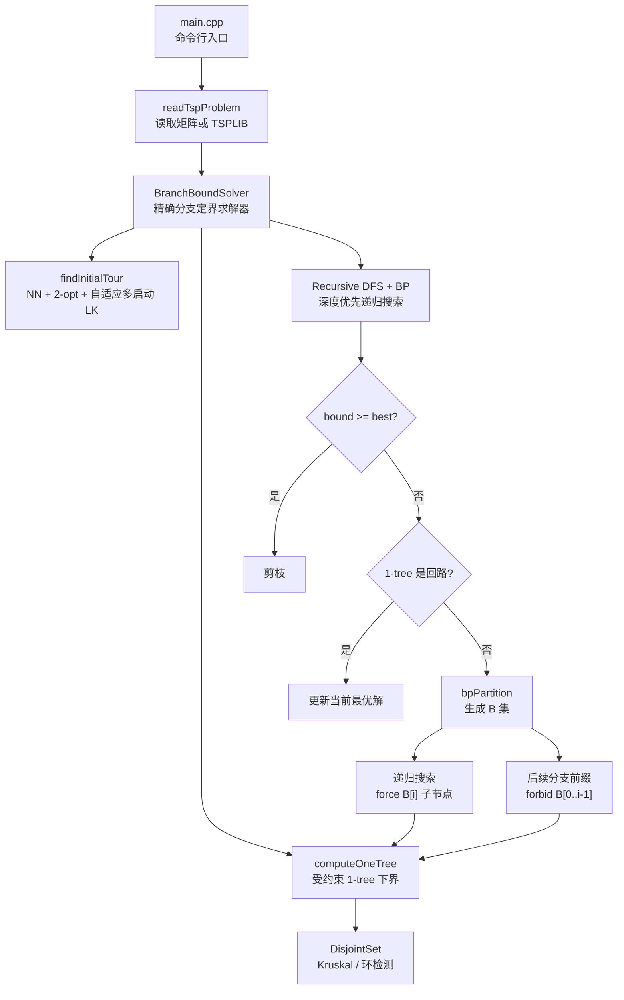

# TSP 分支定界求解器

本项目使用 C++ 实现旅行商问题（TSP）的分支定界算法。当前版本面向**对称 TSP**，输入可以是完整距离矩阵、带缺边的对称距离矩阵或受支持的 TSPLIB 文件。

默认 CMake 目标和可执行文件均命名为 `tsp_bb`：按度数违规顶点选择分支边，并使用当前增量 MST / 1-tree 优化。MST 分支归档产物位于 `solver/07-20-MST/tsp_bb`，修改说明见 `solver/07-20-MST/07-20-MST.md`。四个 `07_14` 实验变体仍由同一份 `src/TspSolver.cpp` 编译，用于历史策略对比。

核心设计：

- 使用分支定界搜索。
- 以无向边作为分支变量。
- 精确求解使用递归 DFS 和 BP（branch partitioning）多路分支，不使用优先队列。
- 每个搜索节点维护 `forced` 必选边、`forbidden` 排除边及经过约束过滤的候选边。
- 默认 `deg` 策略从当前 1-tree 的度数违规顶点选择未决边；`min_edge` 策略从整个 1-tree 选择最轻未决边。
- 下界使用受约束 `1-tree`：在顶点 `1..n-1` 上构造 MST，再给顶点 `0` 加两条可用的最短关联边。
- 根节点默认用 Polyak 次梯度优化 Held-Karp 顶点势，随后在整轮 DFS 中固定
  势和边权；也可切换到论文式 Helsgaun 调度或 Polyak 后精修的组合策略。
- 根 1-tree 建立后使用 Held–Karp reduced cost 检查所有边：若强制一条
  非树边的下界已不能改善 incumbent，就永久停用该边；若禁止一条树边的
  replacement 下界已不能改善 incumbent，就将其强制为 `x_e=1` 并重建根树。
- 初始上界使用多起点最近邻、`2-opt` 和 LK；不同的 NN+2-opt 局部最优
  会进入候选池，搜索节点超过自适应预算后追加多启动 LK。若上界改善，
  当前 DFS 会完整回退，并用新上界重新优化根势后重启。
- 支持单实例、批处理、随机实例生成、独立精确校验和 TSPLIB 直接读取。

## 总体架构


```mermaid
flowchart TD
    A["main.cpp<br/>命令行入口"] --> B["readTspProblem<br/>读取矩阵或 TSPLIB"]
    B --> D["BranchBoundSolver<br/>精确分支定界求解器"]
    D --> R["findInitialTour<br/>NN + 2-opt + 自适应多启动 LK"]
    D --> E["computeOneTree<br/>受约束 1-tree 下界"]
    E --> F["DisjointSet<br/>Kruskal / 环检测"]
    D --> G["Recursive DFS + BP<br/>深度优先递归搜索"]
    G --> H{"bound >= best?"}
    H -- "是" --> I["剪枝"]
    H -- "否" --> J{"1-tree 是回路?"}
    J -- "是" --> K["更新当前最优解"]
    J -- "否" --> L["bpPartition<br/>生成 B 集"]
    L --> M["递归搜索<br/>force B[i] 子节点"]
    L --> N["后续分支前缀<br/>forbid B[0..i-1]"]
    M --> E
    N --> E
```

`main.cpp` 负责命令行解析、输入读取和结果输出。精确算法集中在 `BranchBoundSolver` 中，包括递归分支定界、1-tree 下界、分支边选择、剪枝和最优解更新。

完整的仓库组件图、构建关系、`solve/search/bpPartition` 流程图、Prim 势更新流程和对应伪代码见 [`docs/PHKMST-project-architecture-and-algorithms.md`](docs/PHKMST-project-architecture-and-algorithms.md)。

## 构建

```bash
cmake -S . -B build -DCMAKE_BUILD_TYPE=Release
cmake --build build --target tsp_bb
```

主可执行文件为 `./build/tsp_bb`，使用 degree 分支策略和当前增量 MST / 1-tree 实现。MST 分支的已编译归档副本命名为 `solver/07-20-MST/tsp_bb`。

四个可复现实验目标如下：

| CMake 目标 / 可执行文件 | 分支策略 | 子节点 1-tree | 编译宏 |
|---|---|---|---|
| `tsp_bb_26_07_14_deg` | degree | 增量 | 无（默认配置） |
| `tsp_bb_26_07_14_min_edge` | min-edge | 增量 | `TSP_BRANCH_STRATEGY_MIN_EDGE` |
| `tsp_bb_26_07_14_full_deg` | degree | 全量重建 | `TSP_DISABLE_INCREMENTAL_ONETREE` |
| `tsp_bb_26_07_14_full_min_edge` | min-edge | 全量重建 | 两个宏同时定义 |

按名称构建单个变体，或一次构建全部变体：

```bash
cmake --build build --target tsp_bb_26_07_14_full_deg
cmake --build build --target tsp_bb_variants
```

四个命名目标默认不参与普通的 `cmake --build build`，避免每次重复编译。`solver/tsp_bb_26_07_14_*` 中的文件是归档产物；验证当前源码时应使用上述 CMake 目标重新构建。

本轮 `07_14` 正确性修复的可复现源码提交是 `313143543b29a3ed469e5296f5356b4ddc12109d`。四个归档目录的 readme 分别记录了完整 hash、目标名和跨系统构建命令；目录内旧二进制不代表该提交，应以重新构建的目标为准。

## 输入格式

程序读取一个方阵。第一项是顶点数 `n`，后面是 `n * n` 个距离。

```text
5
0  2  9 10  7
2  0  6  4  3
9  6  0  8  5
10 4  8  0  6
7  3  5  6  0
```

缺边可以写成 `inf`、`infinity`、`-` 或 `x`。顶点编号在输出中使用从 `0` 开始的索引。

程序也可以直接读取常见 TSPLIB `TSP` 文件，包括 `NODE_COORD_SECTION`
坐标型实例和 `EDGE_WEIGHT_SECTION` 显式矩阵实例。当前 C++ 读取器支持
`EUC_2D`、`CEIL_2D`、`FLOOR_2D`、`MAN_2D`、`MAX_2D`、`EUC_3D`、
`CEIL_3D`、`MAN_3D`、`MAX_3D`、`ATT`、`GEO` 和常见显式矩阵格式。

## 单实例运行

从文件读取：

```bash
./build/tsp_bb examples/five-city.txt
```

程序始终运行精确分支定界。`--exact-max-n` 是构造稠密距离矩阵前的规模保护参数，默认值为 `10000`；它不是复杂度保证。需要降低保护上限时可以显式指定：

```bash
./build/tsp_bb --exact-max-n 5 examples/five-city.txt
```

分支定界具有指数级最坏复杂度，实际使用仍应优先从小实例开始。

查看主求解过程中的实时 debug 输出：

```bash
./build/tsp_bb --debug --debug-interval 1000 examples/five-city.txt
```

debug 信息写到标准错误，不会破坏批处理模式的 CSV 标准输出。求解器会输出初始上界、
根节点下界、周期性搜索节点统计和新 incumbent。

`--debug-interval` 必须是大于 `0` 的整数。未指定 `--debug` 时不会输出 debug 信息。

### Held-Karp 根上升策略

默认策略保持当前 HKMST 的 Polyak 步长。以下选项可用于论文策略对照：

```bash
./build/tsp_bb --hk-ascent polyak data/classic/tsplib/eil101.tsp
./build/tsp_bb --hk-ascent helsgaun data/classic/tsplib/eil101.tsp
./build/tsp_bb --hk-ascent hybrid data/classic/tsplib/eil101.tsp
./build/tsp_bb --hk-ascent none data/classic/tsplib/eil101.tsp
```

- `none`：原始固定根 1-tree，不使用顶点势；
- `polyak`：当前默认，使用 incumbent gap 归一化步长；
- `helsgaun`：使用论文的 period/步长减半和 `0.7/0.3` 平滑次梯度；
- `hybrid`：先执行 Polyak，再从其最佳势出发用 Helsgaun 调度精修，并保留
  固定根下界更强的势。

只比较根下界而不进入精确搜索：

```bash
./build/tsp_bb --root-bound-only --hk-ascent polyak \
  --batch data/classic/batch-hk-ascent.txt
```

此模式输出的 `method` 为 `root-bound`；`cost/tour` 是启发式可行上界，不是
最优证明。完整实验与结论见
[`docs/HKMST-LKH-1tree-experiment-2026-08-06.md`](docs/HKMST-LKH-1tree-experiment-2026-08-06.md)。

### 根 α-nearness 分支顺序

局部策略保持原 BP 规则：先固定一个最大度违规顶点，再用根静态 α 排序其
关联边。全局策略则考察当前 1-tree 中所有至少接触一个度违规顶点的未决边，
先比较 α，平局时再优先两端超度覆盖量较大的边：

```bash
./build/tsp_bb --branch-edge-order root-alpha-asc input.tsp
./build/tsp_bb --branch-edge-order root-alpha-desc input.tsp
./build/tsp_bb --branch-edge-order root-alpha-global-asc input.tsp
./build/tsp_bb --branch-edge-order root-alpha-global-desc input.tsp
```

这些选项只改变 BP 分支边顺序，不改变候选集、1-tree 下界或精确性。

参数消融可先运行三实例正确性 smoke suite：

```bash
python3 tools/run_phkmst_ablation.py \
  --solver ./build/tsp_bb \
  --suite smoke \
  --output-dir outputs/phkmst-ablation-smoke
```

脚本内置 `smoke/core/trigger/alpha/all` 五组参数集合；输出配置、原始运行、
逐实例结果和汇总四份 CSV 及一份 Markdown 表。默认 smoke 清单见
`data/classic/batch-ablation-smoke.txt`，并以 TSPLIB 已知最优值检查每组结果，
任一策略成本不一致时返回非零状态。

### 搜索节点势更新实验

根节点仍先执行 `--hk-ascent`。后续节点可从当前势 warm start，在当前
forced/forbidden/active-candidate 约束下运行有限轮势上升。节点内部默认使用
Polyak，也可用 `--hk-node-ascent helsgaun` 切换到论文式 period 和平滑次梯度；
触发机制及 epoch 生命周期保持不变。临时证书模式不改变 HKMST；`subtree-*`
模式重建所有依赖势的排序和增量状态，使新势在整个锚点子树中持续生效，
回溯到兄弟节点时恢复。

```bash
# 每隔 2 层更新一次
./build/tsp_bb --hk-potential-update depth \
  --hk-update-depth 2 --hk-update-iterations 16 input.tsp

# 达到深度 1 后，只在节点 gap 不超过 1% 时更新
./build/tsp_bb --hk-potential-update adaptive \
  --hk-update-depth 1 --hk-update-gap-ratio 0.01 \
  --hk-update-iterations 16 --hk-update-budget 5000 input.tsp

# 推荐的持久子树更新：距上次更新至少 2 层，且节点 gap 不超过 2%
./build/tsp_bb --hk-node-ascent polyak \
  --hk-potential-update subtree-adaptive \
  --hk-update-depth 2 --hk-update-gap-ratio 0.02 \
  --hk-update-iterations 16 --hk-update-budget 5000 input.tsp

# 同一触发配置下对照节点 Helsgaun 调度
./build/tsp_bb --hk-node-ascent helsgaun \
  --hk-potential-update subtree-adaptive \
  --hk-update-depth 2 --hk-update-gap-ratio 0.02 \
  --hk-update-iterations 16 --hk-update-budget 5000 input.tsp
```

- `none`：默认值，不在搜索节点更新势；
- `depth`：深度为 `--hk-update-depth` 整数倍时触发；
- `adaptive`：深度不小于该值、1-tree 仍有度数违规，且
  `(UB-LB)/max(1,|UB|)` 不超过 `--hk-update-gap-ratio` 时触发；
- `subtree-depth`：距当前势 epoch 至少指定层数时更新并重建子树状态；
- `subtree-adaptive`：在 `subtree-depth` 条件上再加相对 gap 门槛；
- `--hk-update-budget` 是每轮精确 DFS 的最大更新尝试次数。diversified-LK
  探测轮自动封顶 1000，重启或探测结束后使用完整预算。

批处理 CSV 和单实例输出还会报告成功安装的 subtree epoch 数及重建时间。
证书模式实验见
[`docs/HKMST-node-potential-update-experiment-2026-08-06.md`](docs/HKMST-node-potential-update-experiment-2026-08-06.md)，
持久子树实验见
[`docs/HKMST-persistent-potential-epoch-experiment-2026-08-06.md`](docs/HKMST-persistent-potential-epoch-experiment-2026-08-06.md)，
节点 Polyak/Helsgaun 对照见
[`docs/PHKMST-node-potential-helsgaun-experiment-2026-09-01.md`](docs/PHKMST-node-potential-helsgaun-experiment-2026-09-01.md)。

从标准输入读取：

```bash
./build/tsp_bb < examples/five-city.txt
```

典型输出包含根节点下界、初始上界、搜索节点数、剪枝数、最优值和最优回路。

## 批处理运行

批处理模式读取一个清单文件，每行一个实例路径。空行和以 `#` 开头的行会被忽略。

```bash
./build/tsp_bb --batch examples/batch.txt
```

输出是 CSV，字段为：

```text
instance,status,method,dimension,cost,root_lower_bound,initial_upper_bound,
instance_wall_seconds,nodes_created,nodes_expanded,pruned_by_bound,pruned_infeasible,
potential_updates_attempted,potential_updates_improved,potential_updates_pruned,
potential_updates_rebuilt,potential_updates_stopped_prunable,
potential_update_iterations,potential_update_seconds,
potential_update_rebuild_seconds,potential_update_total_gain,
potential_update_max_gain,tour,message
```

`status=ok,method=exact` 表示精确求解得到最优 tour；精确搜索证实无解时为 `status=infeasible`。每个实例的 debug 信息仍只写到标准错误。
`instance_wall_seconds` 单独计量每个实例从解析输入到 `solve()` 返回的墙钟时间；
它不包含批处理进程启动和 CSV 输出时间。

后续验证经典数据集时，可以把矩阵或 TSPLIB 实例路径写入一个清单文件：

```bash
./build/tsp_bb --batch path/to/classic-list.txt > classic-results.csv
```

## 经典数据集下载

`tools/download_benchmarks.py` 会下载并解压常用经典数据集到本地，同时生成 batch 清单：

```bash
python3 tools/download_benchmarks.py \
  --output data/classic \
  --datasets tsplib,national,vlsi,dimacs \
  --insecure
```

`--insecure` 只用于兼容部分旧学术站点的证书链问题。下载完成后会生成：

- `data/classic/batch-tsplib.txt`
- `data/classic/batch-national.txt`
- `data/classic/batch-vlsi.txt`
- `data/classic/batch-dimacs.txt`
- `data/classic/batch-all.txt`

当前精确分支定界仍主要适合小中规模实例；National、VLSI、DIMACS 和 TSPLIB
中的大实例应使用独立的启发式求解器，或后续接入 LKH/Concorde 作为强基线。

## HKMST 与 NEWHKMST 对比实验

分别从 `HKMST` 和 `NEWHKMST` 分支构建 Release 可执行文件，并放到：

```text
solver/HKMST/tsp_bb
solver/NEWHKMST/tsp_bb
```

随后运行：

```bash
python3 -m pip install openpyxl
python3 tools/compare_hkmst_newhkmst.py
```

脚本默认选取 `examples`、TSPLIB 和 National 中所有 `n < 200` 的实例，依次
对比 Concorde、HKMST 和 NEWHKMST。NEWHKMST 自动启用当前推荐的持久子树
势更新参数；结果写入
`docs/HKMST-NEWHKMST-Concorde-comparison.xlsx`。

Excel 的“逐实例对比”工作表每个实例一行，包含三种算法的求解结果、时间、
节点数，以及 HKMST 相对 Concorde、NEWHKMST 相对 Concorde/HKMST 的时间
提升率和 NEWHKMST 相对 HKMST 的分支减少率。正向提升显示绿色，退化显示
红色。“汇总”工作表报告完成数、超时、错误、总计/平均/中位时间和节点总数。

常用实验选项：

```bash
# 每种算法重复 3 次并取 wall time 中位数，同时忽略旧缓存
python3 tools/compare_hkmst_newhkmst.py --repeats 3 --fresh

# 只验证指定的小实例
python3 tools/compare_hkmst_newhkmst.py \
  --instances examples/five-city.txt data/classic/tsplib/burma14.tsp
```

## TSPLIB 直接读取

求解器可以直接读取常见的对称 TSPLIB `TSP` 文件，不需要先转换成方阵。坐标型实例由读取器按 `EDGE_WEIGHT_TYPE` 计算距离，显式权重实例则按 `EDGE_WEIGHT_FORMAT` 展开。

支持的 `EDGE_WEIGHT_TYPE`：

- `EUC_2D`
- `CEIL_2D`
- `FLOOR_2D`
- `MAN_2D`
- `MAX_2D`
- `EUC_3D`
- `CEIL_3D`
- `MAN_3D`
- `MAX_3D`
- `ATT`
- `GEO`
- `EXPLICIT`

支持的 `EDGE_WEIGHT_FORMAT`：

- `FULL_MATRIX`
- `UPPER_ROW`
- `UPPER_DIAG_ROW`
- `LOWER_ROW`
- `LOWER_DIAG_ROW`
- `UPPER_COL`
- `UPPER_DIAG_COL`
- `LOWER_COL`
- `LOWER_DIAG_COL`

当前求解器的 1-tree 下界和无向边分支只适用于对称 TSP；非对称矩阵不在支持范围内。直接求解项目内的 TSPLIB 示例：

```bash
./build/tsp_bb examples/tsplib/five-node-euc.tsp
./build/tsp_bb examples/tsplib/five-node-explicit.tsp
```

批处理清单同样可以混合矩阵文件和 TSPLIB 文件，每行写一个路径即可：

```bash
./build/tsp_bb --batch examples/batch.txt
```

## 随机实例生成

生成完整随机对称图：

```bash
python3 tools/generate_random_instances.py \
  --output examples/random/complete \
  --count 10 \
  --min-n 4 \
  --max-n 8 \
  --seed 20260508 \
  --prefix rnd
```

生成稀疏随机图。脚本会先嵌入一条 Hamilton 回路，保证实例至少有一个可行解：

```bash
python3 tools/generate_random_instances.py \
  --output examples/random/sparse \
  --count 6 \
  --min-n 5 \
  --max-n 8 \
  --seed 20260509 \
  --prefix rnd \
  --sparse-density 0.35
```

生成目录中会自动包含 `batch.txt`，可直接用于批处理。

## 正确性测试

默认测试目标与主程序一样使用 degree + incremental 配置，并额外定义 `TSP_VERIFY_INCREMENTAL_STATE=1`。验证模式会在搜索中把复用的增量 1-tree 与完整重建结果比较；它只用于测试二进制，不会增加发布版 `tsp_bb` 的运行开销。

```bash
cmake -S . -B build -DBUILD_TESTING=ON -DCMAKE_BUILD_TYPE=Release
cmake --build build --target tsp_solver_tests
ctest --test-dir build --output-on-failure
```

自动测试包括增量 replacement 的单步与连续 forbid 对拍、BP 前缀约束回归、已知 5 点错解回归、极小权重缩放回归、固定随机种子的完整图/稀疏图端到端穷举对拍，以及精确求解和 TSPLIB 命令行冒烟测试。测试通过只说明当前测试集未发现差异，不应替代对新数据分布的独立验证。

### 独立实例校验

`tools/verify_instances.py` 使用 Held-Karp 动态规划独立计算精确最优值，再和 `tsp_bb` 的输出比较。

```bash
python3 tools/verify_instances.py \
  --batch-list examples/batch.txt \
  --solver ./build/tsp_bb
```

Held-Karp 是指数级算法，只适合小规模实例验证。默认只校验 `n <= 12` 的实例。

## 当前示例

项目内包含：

- `examples/five-city.txt`：手写 5 点矩阵实例。
- `examples/random/complete/`：完整图随机实例。
- `examples/random/sparse/`：含缺边但保证可行的随机实例。
- `examples/tsplib/`：TSPLIB 直接读取测试实例。
- `examples/batch.txt`：统一批处理清单。

## 可以训练到的 C++ 能力

这个项目不只是一个 TSP 算法脚本，也可以作为小型 C++ 算法工程训练项目。

涉及的 C++ 技术：

- `std::vector`：存储矩阵、边集合、路径、度数和搜索状态。
- `struct` / `class`：封装 `BranchBoundSolver`、`Edge`、`Node`、`OneTree` 和求解结果。
- RAII 风格文件输入：使用 `std::ifstream` 和 `std::istream`。
- 异常处理：使用 `std::runtime_error` 报告非法输入和不支持的矩阵。
- STL 算法：`std::sort`、`std::reverse`、`std::all_of`、`std::iota`、`std::move`。
- 递归 DFS：实现分支定界主搜索过程。
- 并查集：用于 Kruskal MST 和环检测。
- 浮点处理：无穷大、有限性检查和误差容忍。
- CMake：组织构建、设置头文件路径、设置 C++ 标准和警告选项。

涉及的算法与工程能力：

- TSP 和 Hamilton 回路建模。
- 1-tree 下界构造。
- 分支定界剪枝。
- 边约束状态建模。
- 最近邻和 2-opt 启发式上界。
- 随机测试、批处理实验和独立正确性验证。
- TSPLIB 数据读取和经典数据集实验准备。
