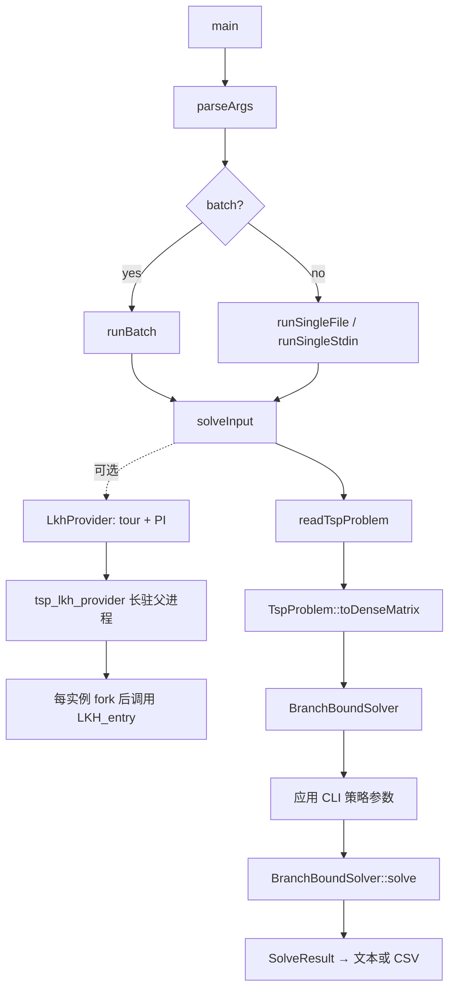
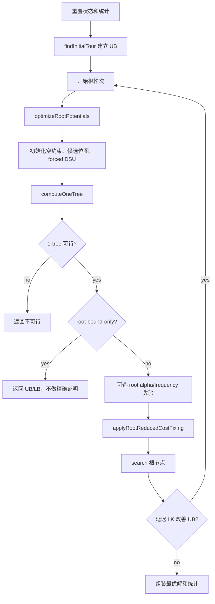
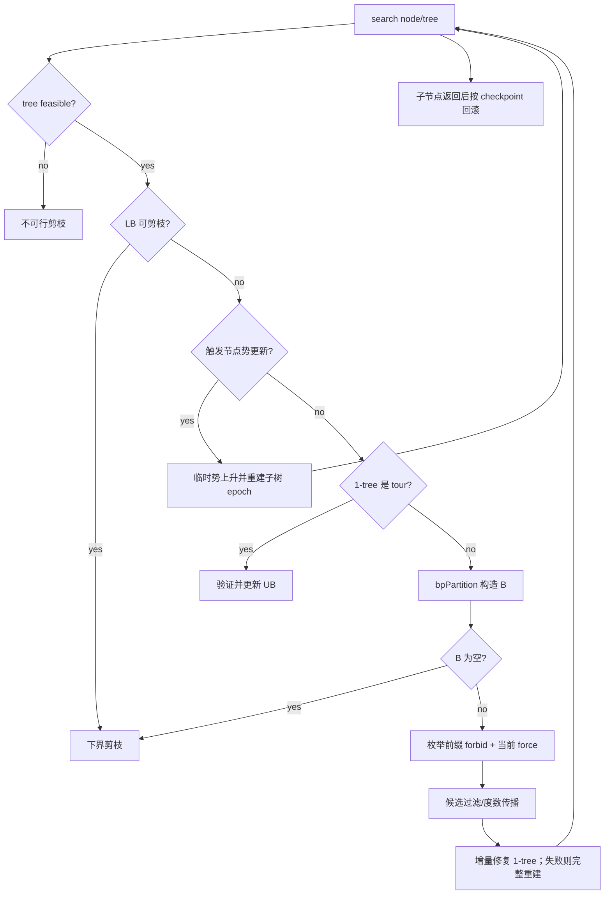

# CPHKMST 源码架构与主求解流程

> 更新时间：2026-09-14  
> 对应分支：`CPHKMST`  
> 对应基线提交：`2de1669`

本文面向第一次完整阅读 `include/TspSolver.hpp` 与 `src/` 的读者。重点是当前实际执行的精确求解路径，不把历史实验二进制或分析脚本混入主线。

## 1. 构建与编辑器基线

- CMake 最低版本：3.16；当前已用 CMake 4.3.2 验证。
- 语言标准：C++17。
- 当前验证编译器：Apple Clang/clangd 17，arm64 macOS。
- `CMakeLists.txt` 强制生成 `build/compile_commands.json`。
- 仓库根 `compile_commands.json` 是指向 `build/compile_commands.json` 的相对符号链接。
- `.clangd` 和 `.vscode/c_cpp_properties.json` 均使用同一编译数据库和 C++17。

推荐构建命令：

```bash
cmake -S . -B build -DCMAKE_BUILD_TYPE=Debug
cmake --build build -j4
ctest --test-dir build --output-on-failure
```

`src/*.ipp` 不是独立翻译单元，而是由 `TspSolver.cpp` 在特定位置拼接。它们在编辑器中单独打开时会受宏保护地载入完整 `TspSolver.cpp` 上下文，因此可以获得正确诊断、跳转和补全；正式构建仍然只有一个求解器翻译单元。

修改 IDE 配置后若旧诊断仍在，执行一次“Restart language server”或重载工作区。

## 2. 活动源码架构

| 文件 | 职责 | 是否独立编译 |
|---|---|---:|
| `src/main.cpp` | CLI 参数、单实例/批处理调度、输出 | 是 |
| `include/LkhProvider.hpp` / `src/LkhProvider.cpp` | 可选 LKH provider 客户端、协议、tour/PI 校验和临时目录 | 是 |
| `src/lkh_provider_worker.c` | 本地 LKH 的长驻父进程；每次请求 fork 隔离子进程 | 可选 C 目标 |
| `include/TspSolver.hpp` | 公共 API、策略枚举、结果统计、精确搜索内部状态声明 | 头文件 |
| `src/TspSolver.cpp` | 根势、节点势、1-tree、root fixing、BP 搜索、增量 MST 和回滚 | 是 |
| `src/TspProblemText.ipp` | 文本清理、大小写和 TSPLIB 基础转换 | 否 |
| `src/TspProblemWeight.ipp` | 显式矩阵权值解析 | 否 |
| `src/TspProblemCoordinate.ipp` | EUC、CEIL、ATT、GEO 等坐标距离 | 否 |
| `src/TspProblemModel.ipp` | `TspProblem` 查询与稠密矩阵物化 | 否 |
| `src/TspProblemIO.ipp` | 普通矩阵/TSPLIB 自动识别和读取 | 否 |
| `src/TspInitialTour.ipp` | 精确求解前的 NN、2-opt、PHKMST 单起点 CLK 与后置 CLK | 否 |
| `src/TspLinKernighan.ipp` | 2-opt、顺序 k-opt、double-bridge 和 Chained LK | 否 |
| `src/TspHeuristicSolver.ipp` | 独立的通用近似 API；当前 `tsp_bb` 精确 CLI 不调用它 | 否 |

`TspSolver.cpp` 内部的实际拼接次序是：

```text
通用数值/调试辅助
  → TspProblemText
  → DisjointSet
  → TspProblemWeight
  → TspProblemCoordinate
  → TspProblemModel
  → BranchBoundSolver 主实现
  → TspInitialTour
  → tourCost
  → TspLinKernighan
  → TspProblemIO
  → TspHeuristicSolver
```

这个顺序解释了为什么 `.ipp` 不能被当成普通、彼此独立的 `.cpp`。

## 3. 入口调用链



阅读 `main.cpp` 时先看 `main → runSingle/runBatch → solveInput`，CSV 格式化和长参数解析可以放到最后。

## 4. 核心数据结构

### 4.1 对外数据

- `TspProblem`：保存 TSPLIB 元数据、坐标或显式矩阵。
- `SolveResult`：最终可行性、tour、cost 和 `SolveStats`。
- `SolveStats`：节点数、上下界、root fixing、势更新、warm start 和各阶段耗时。

### 4.2 精确搜索内部数据

- `Edge`：规范化无向边；`w` 在精确搜索中通常是势调整后的权重。
- `OneTree`：可行标志、LB、恰好 `n` 条树边、顶点度数，以及增量 MST 索引。
- `PartialSol`：当前 BP 节点的 forced/forbidden、forced DSU、候选位图和缓存。
- `BranchChoice/BranchSet`：BP 构造出的关键边链及 forbid replacement 重放信息。
- `TreeUndo/CandidateUndo`：递归返回父节点时恢复 1-tree 和候选状态的事务日志。

需要始终记住的四个量：

```text
best_cost_             当前可行 tour 上界 UB
OneTree::cost          当前受约束 Held-Karp 下界 LB
PartialSol             当前分支约束
candidate_bits         当前势 epoch 内仍 active 的精确搜索边
```

## 5. 三种“候选边”不要混淆

当前实现不是用稀疏 k-NN 图替代完整精确搜索图：

1. `candidates_sorted_` 包含当前问题的全部有限无向边，是精确 1-tree、fixing 和 BP 的可证明搜索空间；root fixing 后才会安全失活部分边。
2. `candidate_set_` 是每点最多 8 个近邻，只给 LK 搜索加速，不决定精确可行域。
3. `candidate_hint_neighbors_` 来自启发式 tour，只用于优先找到 MST replacement 的上界；未证明最轻时仍回退扫描完整 active 候选集。

因此，启发式候选未命中不会使精确求解漏解。真正永久删除边的依据来自约束传播或合法下界证明。

## 6. `solve()` 主流程



### 6.1 初始上界

`findInitialTour()` 与 PHKMST 对齐：枚举 NN 起点并做 2-opt，只对最佳结果执行
一次确定性 8-NN CLK。启用 LKH provider 时，LKH tour 作为额外 incumbent，
并关闭这一次内部 CLK，避免重复支付同类局部搜索成本。

搜索节点达到困难度阈值后，`maybeImproveIncumbentDiversified()` 还可运行一次延迟多起点 LK；改善时整轮 DFS 回退并从根重启。

### 6.2 根 Held-Karp 下界

`optimizeRootPotentials()` 对顶点势 `π` 做次梯度上升。每次评估构造修改权重下的最小 1-tree：

```text
wπ(u,v) = dist(u,v) + π[u] + π[v]
LB = Σ(one-tree 中的 wπ) - 2Σπ - roundoff_guard
次梯度 g[v] = degree[v] - 2
```

根策略可为 None、Polyak、Helsgaun、Hybrid、HybridReverse 或两种平滑 Polyak。最佳势被保存，随后候选边按该势 epoch 的调整权重排序。

### 6.3 受约束 1-tree

`computeOneTree()`：

```text
先加入 forced 的非根边并验证无非法环
  → Kruskal 补齐顶点 1..n-1 上的 MST（共 n-2 条边）
  → 加入/补足顶点 0 的两条根边
  → 计算 degree 与修正后的 LB
  → 初始化动态 MST 邻接位图和 edge-index
```

若每个顶点度数正好为 2，1-tree 就是一条 Hamilton 回路。

### 6.4 根 fixing

`applyRootReducedCostFixing()` 在进入 DFS 前把可证明结论变成根永久基线：

- 非树边：强制加入所需的最小代价增量已足以令 LB 越过 UB，则固定 `x_e=0`。
- 树边：临时 forbid 后的最优 replacement 仍令 LB 越过 UB，则固定 `x_e=1`。
- 某顶点已有两条 forced 边后，其他 incident 未决边由度数约束失活。
- 候选图出现度数不足 2、forced 子回路或无 replacement 时判不可行。

这些删除不会在 DFS 回滚，因为它们属于当前根轮次已经证明的约束。

## 7. `search()` 与 BP 主循环



若 `B=[e1,e2,e3]`，精确覆盖的子节点为：

```text
force(e1)
forbid(e1), force(e2)
forbid(e1), forbid(e2), force(e3)
```

“全部 B 边都 forbid”的剩余分支已经在 `bpPartition()` 构造 B 的终止测试中证明不可改善，因此不需要再建一个孩子。若 `|B|=1`，则该边在当前节点对所有改进 tour 都是必选边，直接传播，不增加逻辑深度。

## 8. 节点势更新

搜索节点先由 `classifyPotentialUpdate()` 检查策略、预算、数值安全、深度间隔、度违规和 gap 区间。触发后：

1. `updateNodePotentialBound()` 在当前 forced/forbidden 图上运行有限轮 Prim 1-tree 势上升。
2. 初值沿用父 epoch 势，不跨兄弟节点混合临时势，与 PHKMST 保持一致。
3. 若得到更强证书，`rebuildPotentialEpoch()` 重建候选排序和 1-tree 状态。
4. 在该子树中递归搜索，退出时完整恢复父 epoch。

临时势从不直接作为未经验证的剪枝依据。

## 9. 增量 MST 与回滚

当 forbid 或候选过滤删掉当前树边时：

```text
删除树边
  → MST 分成两个分量
  → 标记较小分量
  → 在 fundamental cut 上寻找最轻合法 replacement
  → 成功则原位替换并写 TreeUndo
  → 失败/状态不可重放则 computeOneTree 完整重建
```

重点函数阅读顺序：

1. `updateOneTreeAfterForbid()`
2. `updateOneTreeAfterActiveRemoval()`
3. `findMstReplacement()`
4. `markMstComponentWithoutEdge()`
5. `replaceOneTreeEdge()`
6. `rollbackOneTree()`
7. `rollbackCandidates()`

生产 DFS 的基本模式是“checkpoint → 原地修改 → 递归 → rollback”。任何递归出口都必须恢复父状态；测试构建还会用完整重建核对增量结果。

## 10. 推荐阅读顺序

第一遍只追主线：

1. `TspSolver.hpp`：`SolveResult`、策略枚举、`TspProblem`、`BranchBoundSolver` 公共接口。
2. `TspSolver.hpp`：`Edge`、`OneTree`、`PartialSol`、`BranchSet`、两个 Undo。
3. `main.cpp`：`main → solveInput`。
4. `TspProblemIO.ipp → TspProblemModel.ipp`：输入如何变成稠密矩阵。
5. `TspSolver.cpp::solve()`：先把子函数当黑盒。
6. `TspInitialTour.ipp → TspLinKernighan.ipp`：UB 来源。
7. `optimizeRootPotentials() → computeOneTree() → shouldPrune()`：LB 来源。
8. `applyRootReducedCostFixing()`：根边删除/固定的证明。
9. `search() ↔ bpPartition()`：精确搜索树。

第二遍再读性能结构：

10. candidate bitset 与 degree propagation。
11. dynamic MST replacement 与 undo。
12. 节点势更新、epoch 重建和 guarded warm start。
13. 各种 `BranchEdgeOrder` 实验分支。
14. `tests/TspSolverTests.cpp`：用测试反向验证不变量。

第一遍可以跳过统计输出、调试字符串、所有分支排序枚举的具体比较器，以及 `n<=64/128` 的位图快路径；先确认算法正确性链条，再研究常数级优化。

## 11. 精确性检查清单

阅读或修改时，逐项检查：

- UB 是否始终来自逐边重算后的可行 Hamilton tour？
- LB 是否来自满足当前 forced/forbidden 的完整 1-tree？
- 被删边是否有 fixing 证明或只是当前 DFS/epoch 的可回滚状态？
- 启发式候选未命中时是否仍有完整 active 边回退？
- 增量更新失败时是否完整重建？
- 子节点返回后 forced DSU、候选位图、1-tree 和势 epoch 是否全部恢复？
- 浮点剪枝是否经过 `shouldPrune()` 的保守舍入保护？

这七项是理解当前 CPHKMST 为什么仍是 exact solver 的核心。
