# PHKMST 项目架构、流程与伪代码

> 适用分支：`PHKMST`
>
> 更新时间：2026-08-27
> 目标：从软件工程结构、运行时调用关系和核心算法三个层面说明当前项目。

## 1. 项目定位

当前主程序是面向对称 TSP 的精确分支定界求解器。核心下界是 Held-Karp 1-tree，搜索使用 BP（Branch Partitioning）分支，默认 1-tree 完整构造采用 Kruskal，树边失效后优先做增量 MST 替换。PHKMST 的 Prim 实验只用于搜索节点势更新期间的多轮临时 1-tree 评估。

项目同时保留：

- 普通距离矩阵与 TSPLIB 输入解析；
- 初始 tour、2-opt 和 Lin-Kernighan 上界启发式；
- 根势与搜索节点势更新实验；
- root α-nearness 分支排序实验；
- 历史求解器、实验二进制和 Concorde 参考实现；
- 随机实例、经典基准、批处理和性能分析工具。

## 2. 仓库级架构图

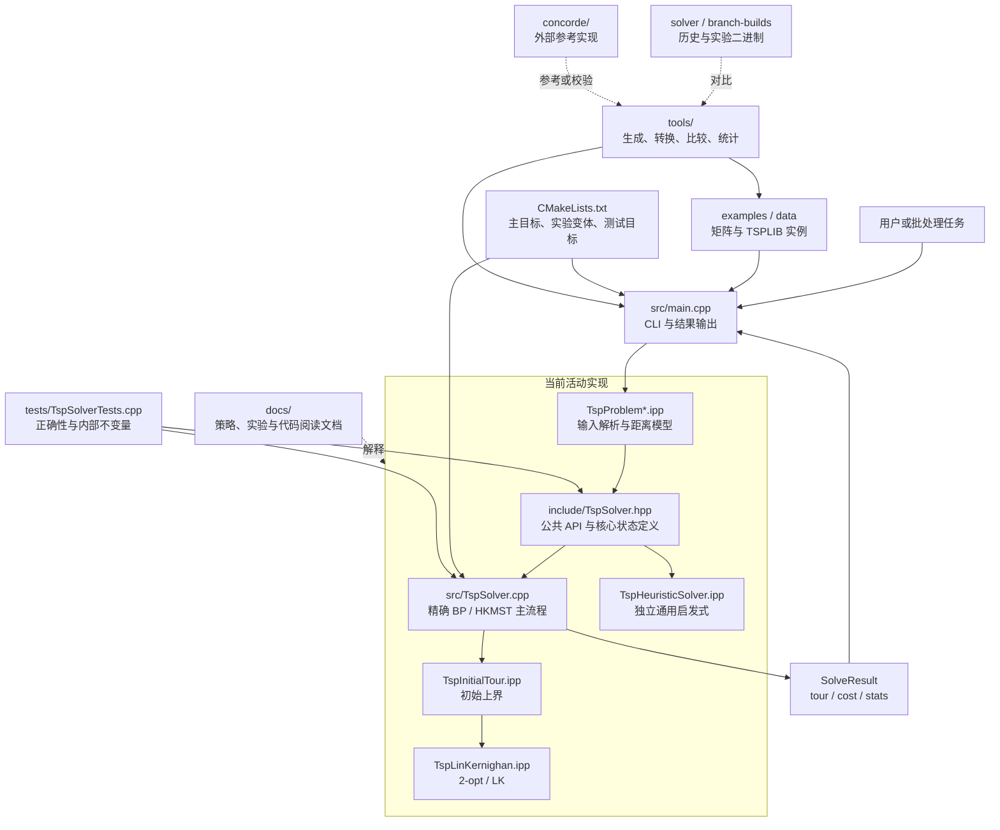

### 2.1 活动源码职责

| 文件 | 软件工程职责 | 是否独立编译 |
|---|---|---|
| `src/main.cpp` | 参数解析、单实例/批处理调度、结果展示 | 是 |
| `include/TspSolver.hpp` | 公共数据模型、配置枚举、求解器接口、内部状态声明 | 头文件 |
| `src/TspSolver.cpp` | 精确求解编排、势更新、1-tree、BP、增量更新和回滚 | 是 |
| `src/TspProblemText.ipp` | 文本规范化和基础数值转换 | 否 |
| `src/TspProblemWeight.ipp` | 显式距离权值解析 | 否 |
| `src/TspProblemCoordinate.ipp` | TSPLIB 坐标距离模型 | 否 |
| `src/TspProblemModel.ipp` | `TspProblem` 访问与稠密矩阵物化 | 否 |
| `src/TspProblemIO.ipp` | 普通矩阵/TSPLIB 识别和读取 | 否 |
| `src/TspInitialTour.ipp` | 精确搜索前的初始 incumbent 构造 | 否 |
| `src/TspLinKernighan.ipp` | 精确路径内部的 2-opt/LK 改善 | 否 |
| `src/TspHeuristicSolver.ipp` | 不进入精确 BP 的独立通用启发式 | 否 |
| `tests/TspSolverTests.cpp` | 黑盒精确性、策略行为、增量状态和回滚验证 | 是 |

`.ipp` 是源码组织边界，不是运行时组件。它们由 `TspSolver.cpp` 按原顺序包含，最终仍形成一个求解器翻译单元。这样既能按职责阅读，又不增加虚调用、跨翻译单元调用或额外状态复制。

## 3. 构建架构

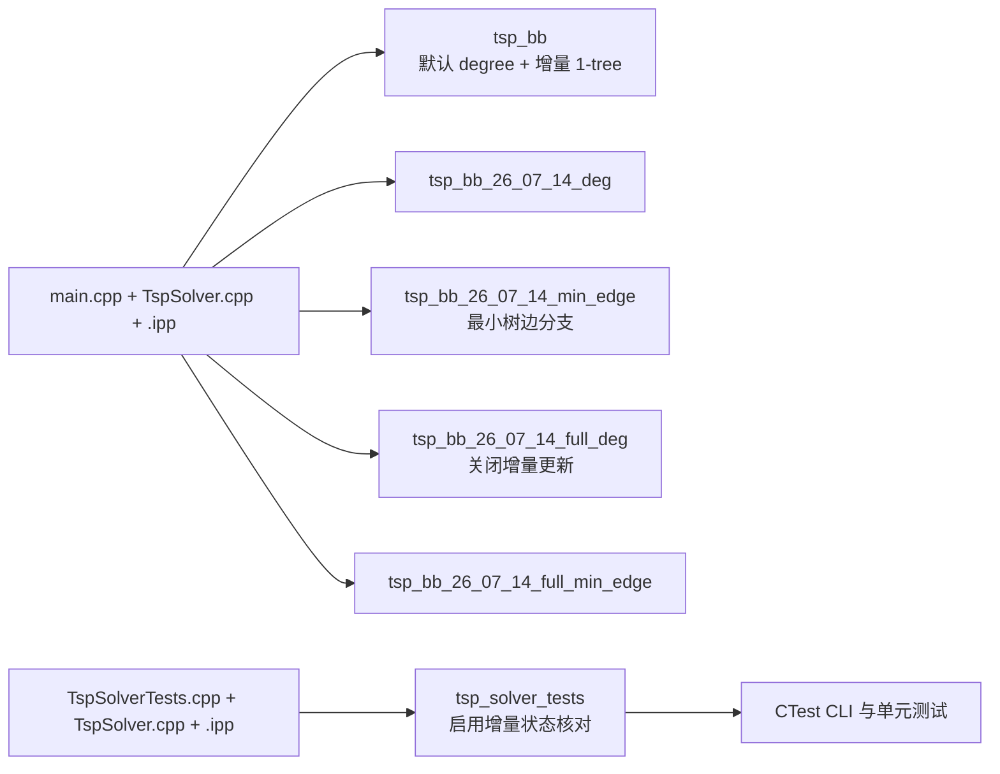

实验变体只通过编译宏改变分支边选择或是否使用增量 1-tree；它们共享同一源文件清单，避免不同目标漏编译某个实现模块。

## 4. 运行时总体流程图

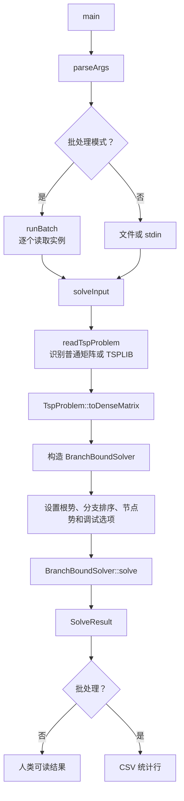

### 总体入口伪代码

```text
function main(args):
    options = parseArgs(args)

    if options.batch_path exists:
        for path in readBatchList(options.batch_path):
            try:
                result = solveInput(open(path), options)
                emitCsvRow(path, result)
            catch error:
                emitCsvError(path, error)
        return aggregateStatus

    input = open(options.input_path) if supplied else stdin
    result = solveInput(input, options)
    emitHumanReadableResult(result)
    return feasible ? 0 : 1

function solveInput(stream, options):
    problem = readTspProblem(stream)
    distance = problem.toDenseMatrix(options.exact_max_n)
    solver = BranchBoundSolver(distance)
    solver.configure(options)
    return solver.solve()
```

## 5. 精确求解器组件关系

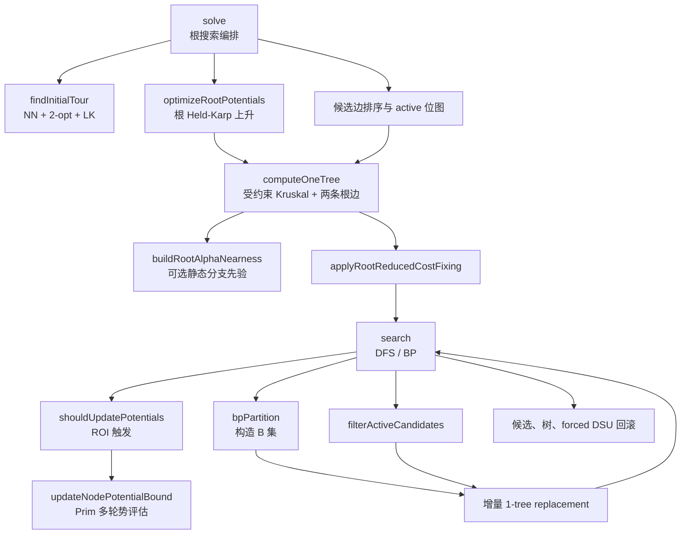

## 6. `solve()` 根搜索流程

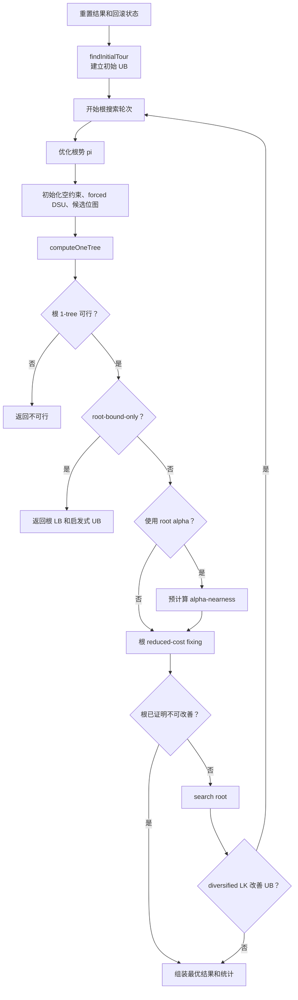

### `solve()` 伪代码

```text
function solve():
    reset all mutable search state
    bestTour, bestCost = findInitialTour()
    bestCost = recomputeExactTourCost(bestTour)

    loop:
        reset per-root-round potential budget
        optimizeRootPotentials(bestCost)

        root = empty PartialSol
        initializeForcedDsu(root)
        candidates = allFiniteEdgesSortedByAdjustedWeight()
        initializeCandidateBitsets(root, candidates)

        rootTree = computeOneTree(root, candidates)
        if rootTree is infeasible:
            return infeasible
        if rootBoundOnly:
            return bestTour, bestCost, rootTree.cost

        if branchOrder uses root alpha:
            buildRootAlphaNearness(rootTree)

        if rootTree cannot already be pruned:
            fixing = applyRootReducedCostFixing(root, rootTree)

        if fixing does not prove no improvement:
            search(root, rootTree, depth = 0)

        assert all undo logs returned to root checkpoints
        if diversified heuristic requested a restart:
            continue with improved bestCost
        break

    return bestTour, bestCost, accumulatedStats
```

## 7. 1-tree 下界流程

1-tree 由两部分构成：顶点 `1..n-1` 上的受约束 MST，以及顶点 `0` 的两条合法最轻边。所有边先使用调整权重：

```text
wπ(u,v) = dist(u,v) + π(u) + π(v)
LB = sum(wπ in one-tree) - 2 * sum(π) - roundoff_guard
```

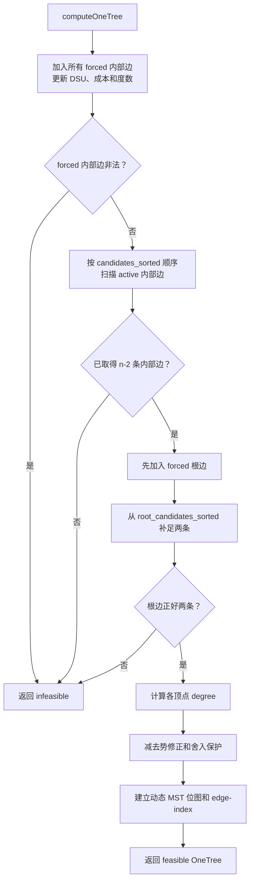

### `computeOneTree()` 伪代码

```text
function computeOneTree(node, sortedCandidates):
    tree = infeasible result
    dsu = one component per vertex
    edges = []
    adjustedCost = node.forced_mst_cost
    mstCount = node.forced_mst_count

    for edge in node.forced_edges excluding root edges:
        if dsu.union(edge.u, edge.v) fails:
            return tree
        edges.append(edge)

    for edge in sortedCandidates active order:
        if mstCount == n - 2: break
        if edge touches root or is forced/forbidden/inactive: continue
        if dsu.union(edge.u, edge.v):
            edges.append(edge)
            adjustedCost += edge.adjustedWeight
            mstCount += 1

    if mstCount != n - 2:
        return tree

    rootEdges = forced root edges
    append lightest legal active root edges until size == 2
    if rootEdges.size != 2:
        return tree

    edges += rootEdges
    adjustedCost += sum(rootEdges.adjustedWeight)
    tree.degree = degreeVector(edges)
    tree.cost = adjustedCost - potentialCorrection - roundoffGuard
    initializeDynamicMst(tree)
    return tree as feasible
```

## 8. BP 搜索与分支循环

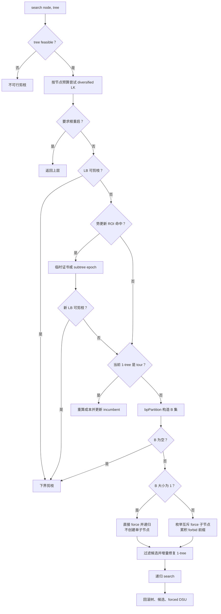

### `search()` 伪代码

```text
function search(node, tree, depth, countNode = true):
    if tree is infeasible:
        pruneInfeasible()
        return

    maybeImproveIncumbentDiversified()
    if rootRestartRequested: return

    node.bound = tree.cost
    if shouldPrune(node.bound, bestCost):
        pruneByBound()
        return

    if shouldUpdatePotentials(tree, depth, node.bound, bestCost):
        if persistent strategy:
            if searchSubtreeWithUpdatedPotentials(node, tree, depth):
                return
        else:
            certificate = updateNodePotentialBound(node)
            node.bound = max(node.bound, certificate.bound)
            if shouldPrune(node.bound, bestCost):
                pruneByBound()
                return

    if countNode: nodesExpanded += 1

    if isTour(tree):
        candidate = buildTour(tree.edges)
        updateIncumbentIfBetter(candidate)
        return

    B = bpPartition(node, tree)
    if B is empty:
        pruneByBound()
        return

    if B.size == 1:
        propagateForcedEdge(B[0])
        return

    parentCheckpoint = checkpoints()
    for i in 0 .. B.size-1:
        childCheckpoint = checkpoints()
        if force(B[i]) and filterActiveCandidates(node):
            childTree = incrementallyRepairOrRebuild(tree)
            if childTree feasible:
                search(node, childTree, depth + 1)
        rollback(childCheckpoint)

        if i + 1 < B.size:
            forbid(B[i])
            advancePrefixTreeByRecordedReplacementOrRebuild()

    rollback(parentCheckpoint)
    clearTemporaryForbidPrefix()
```

### B 集如何形成互斥分支

若 `bpPartition()` 得到：

```text
B = [e1, e2, e3]
```

则递归子问题为：

```text
force(e1)
forbid(e1), force(e2)
forbid(e1), forbid(e2), force(e3)
```

“全部 forbid”的剩余分支已在构造 B 集时被证明不可改善 incumbent，因此无需再创建节点。

### `bpPartition()` 伪代码

```text
function bpPartition(node, workTree):
    B = []
    checkpoint = checkpoints()

    loop:
        branchVertex = vertex with maximum degree above 2
        edge = best undecided tree edge incident to branchVertex
               ordered by adjusted weight or root alpha policy
        if no edge exists: break

        B.append(edge)
        temporarily forbid(edge)
        deactivate edge from candidates

        if incremental forbid repair succeeds:
            record replacement delta in B.back
        else:
            rebuild workTree from current prefix constraints
            mark that replay requires rebuild

        if workTree infeasible or shouldPrune(workTree.cost, bestCost):
            break

    rollback tree and candidate state to checkpoint
    clear temporary forbidden flags for B
    return B
```

## 9. 自适应势更新与 Prim

### 9.1 ROI 触发条件

势更新不会在每个节点无条件执行。`shouldUpdatePotentials()` 首先检查：

- 策略不是 `None`；
- 深度、迭代数和本轮预算有效；
- 1-tree、LB、UB 都是有限值；
- 浮点范围适合做势上升；
- `Σ(degree[v]-2)²` 非零；
- Depth 模式命中固定深度间隔，或 Adaptive 模式满足深度与相对 gap；
- subtree 模式距离上一个势 epoch 达到最小间隔。

相对 gap 为：

```text
relative_gap = max(0, UB - LB) / max(1, abs(UB))
```

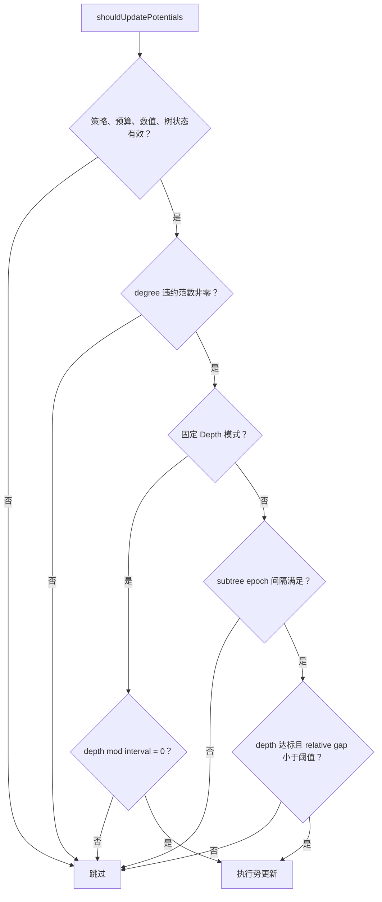

### 9.2 势更新内部 Prim 流程

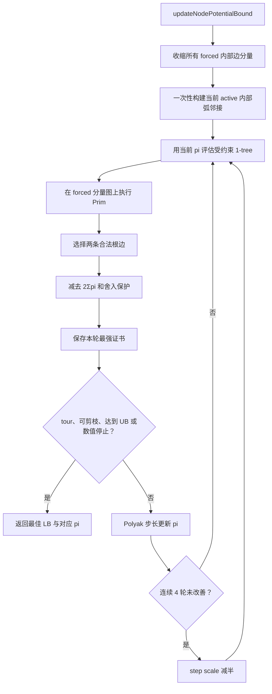

### `updateNodePotentialBound()` 伪代码

```text
function updateNodePotentialBound(node, currentLB, UB, maxIterations):
    forcedComponents = contractForcedInternalEdges(node)
    if forced structure invalid:
        return infeasible certificate

    activeArcs = buildAdjacencyOnce(node, forcedComponents)
    potentials = currentEpochPotentials
    best = certificate(currentLB, potentials)
    stepScale = 2
    noImprovement = 0

    repeat at most maxIterations:
        evaluation = evaluateWithPrim(
            forcedComponents, activeArcs, node.rootConstraints, potentials)
        if evaluation infeasible: break

        if evaluation.bound materially improves best.bound:
            best = evaluation.bound plus copy of potentials
            noImprovement = 0
        else:
            noImprovement += 1

        gradient[v] = evaluation.degree[v] - 2
        normSquared = sum(gradient[v]^2)

        if normSquared == 0 or shouldPrune(best.bound, UB):
            stop remaining iterations

        step = stepScale * (UB - evaluation.bound) / normSquared
        if step is non-positive or non-finite: break
        potentials[v] += step * gradient[v] for every v

        if noImprovement >= 4:
            stepScale /= 2
            noImprovement = 0

    return best
```

### 9.3 临时证书与 subtree epoch

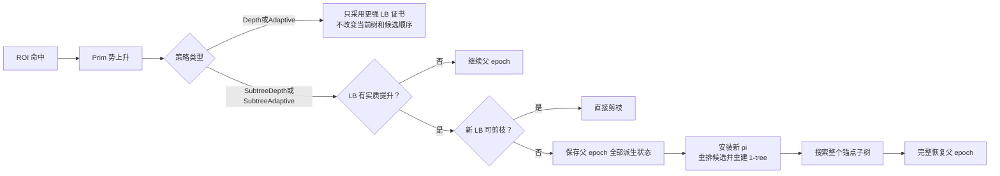

## 10. 增量 MST 更新和回滚

主搜索中的 1-tree 仍以 Kruskal 完整构造为基准。当 forbid、force 或候选过滤让当前树边失效时，优先只替换受影响的边。

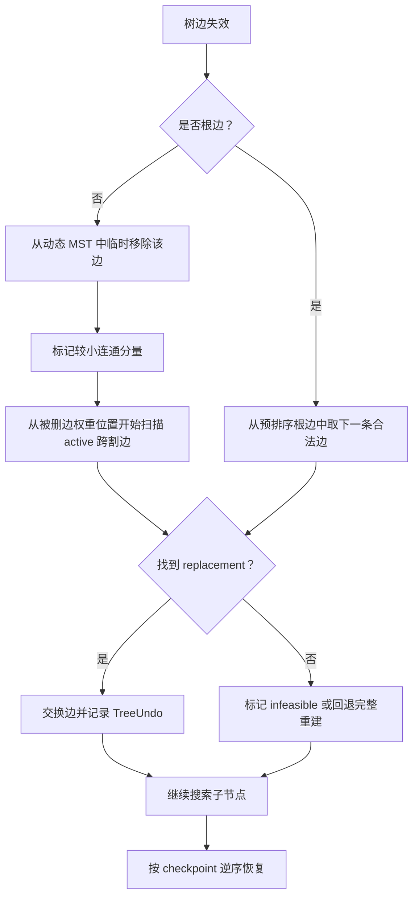

### 增量修复伪代码

```text
function updateOneTreeAfterForbid(node, tree, removedEdge):
    if removedEdge is not in tree:
        return true

    if removedEdge touches root:
        replacement = lightest legal unselected root edge
    else:
        remove removedEdge from dynamic MST logically
        selectedComponent = smaller side of the resulting cut
        replacement = first active internal edge crossing the cut,
                      scanning from lower_bound(removedEdge.weight)

    if replacement does not exist:
        record old state
        mark tree infeasible
        return false

    record TreeUndo(oldEdge, replacement, oldCost, oldFeasible)
    replace edge, degrees, cost, adjacency bits and edge-index mapping
    return true
```

### 回滚伪代码

```text
function exploreChild(node, tree):
    candidateCheckpoint = candidateUndo.size
    treeCheckpoint = treeUndo.size
    forcedSnapshot = applyForceWithReversibleDsuLog()

    mutate candidate bits and tree
    search(child)

    rollbackOneTree(tree, treeCheckpoint)
    rollbackCandidates(node, candidateCheckpoint)
    revertForce(forcedSnapshot)

function rollbackOneTree(tree, checkpoint):
    while treeUndo.size > checkpoint:
        undo = pop treeUndo
        if undo is full snapshot:
            restore moved OneTree snapshot
        else if undo changes only feasibility:
            restore cost and feasible flag
        else:
            reverse replacement edge
            restore degrees, cost, adjacency and edge-index
```

## 11. 关键状态与生命周期

| 状态 | 所有者 | 生命周期 | 回滚方式 |
|---|---|---|---|
| `best_cost_ / best_tour_` | 求解器 | 整次 `solve()` | 单调改善，不随 DFS 回滚 |
| `vertex_potential_` | 势 epoch | 根轮次或 subtree epoch | subtree 使用完整 epoch 快照 |
| `candidates_sorted_` | 势 epoch | 当前势不变期间 | epoch 重建时整体替换 |
| `candidate_bits` | `PartialSol` | 当前 DFS 路径 | `CandidateUndo` checkpoint |
| `forced/forbidden` | `PartialSol` | 当前 DFS 路径 | 显式撤销与 DSU 快照 |
| `forced_parent/rank/size` | `PartialSol` | 当前 DFS 路径 | 无路径压缩，按 `ForceChanges` 恢复 |
| `OneTree` | 当前 DFS 工作树 | 当前根或子树 | `TreeUndo` 或完整快照 |
| `root_alpha_by_edge_id_` | 根搜索轮次 | 根势固定后 | 根重启时重新计算 |
| `SolveStats` | 求解器 | 整次 `solve()` | 不回滚，跨根重启累计 |

## 12. 正确性与性能边界

### 正确性主线

- forced/forbidden 约束必须被 `computeOneTree()` 和增量修复一致遵守；
- 1-tree 下界必须减去势修正，并只向安全方向应用舍入保护；
- `shouldPrune(LB, UB)` 是正式剪枝入口；
- BP 的 B 集必须覆盖所有仍可能改善 incumbent 的 tour；
- DFS 返回时树、候选位图、forced DSU 和势 epoch 必须恢复到 checkpoint。

### 只影响性能或搜索顺序的机制

- 初始 tour、2-opt、LK 和 diversified LK 只收紧 UB；
- root α-nearness 只改变分支边排序；
- Prim 势更新只尝试增强合法下界；
- active 位图、动态 MST、replacement cache 和 undo log 只减少重复计算；
- 任一增量状态不可信时回退完整 `computeOneTree()`。

## 13. 推荐阅读顺序

1. `include/TspSolver.hpp`：先认识结果、配置、`OneTree` 和 `PartialSol`；
2. `src/main.cpp`：理解输入如何进入 `solve()`；
3. `BranchBoundSolver::solve()`：掌握根搜索骨架；
4. `computeOneTree()`：理解下界；
5. `search()` 与 `bpPartition()`：理解分支循环；
6. 增量更新、candidate bitset 和 rollback：理解性能实现；
7. `shouldUpdatePotentials()` 与 `updateNodePotentialBound()`：理解自适应 Prim 势更新；
8. `TspInitialTour.ipp` 与 `TspLinKernighan.ipp`：理解 UB；
9. `TspProblem*.ipp`：理解输入层；
10. `tests/TspSolverTests.cpp`：用测试反向核对所有不变量。

更细的逐段阅读建议见 `docs/PHKMST-code-reading-guide.md`。
